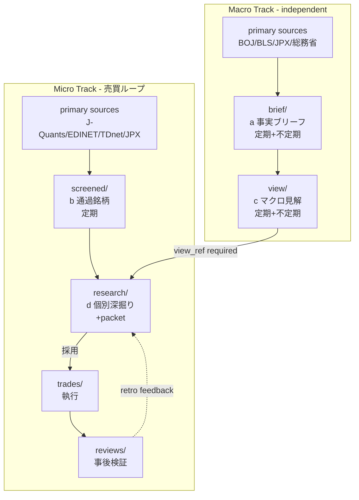

# architecture-v1

Baibai-Loop の **構造・schema・procedure** を記述する正本。  
思想・ベースの考え方は [`philosophy.md`](./philosophy.md) に分離する。

## 0. このドキュメントの役割と境界

- **architecture-v1.md (本ファイル)**: **structure + schema + procedure**。具体的 structure、schema、path、front matter 定義、workflow
- **philosophy.md**: **what we believe + why we chose this design**。価値観、選択の根拠、却下した対立案

重なる topic（例: 「なぜ 4 成分か」）は philosophy 側で思想として書き、本ファイルは「4 成分である」と事実として受けて構造の記述に進む。

## 1. アーキテクチャ概観

Baibai-Loop は **4 成分 + 下流 2 成分** で構成される意思決定ループ基盤である。

| 成分 | directory | 役割 | 頻度 |
| --- | --- | --- | --- |
| **a** | [`brief/`](../brief/) | マクロ事実ブリーフ | 定期（週次/月次）+ 不定期 |
| **b** | `screened/` | スクリーニング通過銘柄 | 定期（週次） |
| **c** | `view/` | マクロ見解 | 定期（月次）+ 不定期 |
| **d** | `research/` | 個別銘柄リサーチ（packet 本体） | screened 後の選定単位 |
| ― | `trades/` | 執行記録 | 採用時 |
| ― | `reviews/` | 事後検証 | 決済後 +15/+30 営業日 + 月次 retro |

Placeholder ディレクトリは v1 で作成しない。`screened/`, `view/`, `research/`, `trades/`, `reviews/` は初回ファイル生成時に自然発生する。

## 2. 全体ワークフロー（2 トラック + 統合 + フィードバック）

### 2.1 ASCII 図（source of truth）

本 ASCII 図を source of truth とする。Mermaid 図は render 補助。

```
┌─────────────── Macro Track (independent) ───────────────┐
│                                                          │
│   primary sources (BOJ/BLS/JPX 等)                       │
│             │                                            │
│             ↓                                            │
│    ┌────────────┐    積み上げ    ┌────────────┐          │
│    │  brief/    │ ─────────────→ │  view/     │          │
│    │  (a) 事実   │                │  (c) 見解  │          │
│    │  定期+不定期│                │  定期+不定期│          │
│    └────────────┘                └─────┬──────┘          │
│                                        │                 │
└────────────────────────────────────────┼─────────────────┘
                                         │ view_ref (required)
┌─────────────── Micro Track ────────────┼─────────────────┐
│                                        │                 │
│   primary sources (J-Quants 等)        │                 │
│             │                          │                 │
│             ↓                          │                 │
│    ┌────────────┐                      │                 │
│    │ screened/  │                      │                 │
│    │ (b) ふるい │                      │                 │
│    │ 定期        │                      │                 │
│    └──────┬─────┘                      │                 │
│           │ screened_ref (required)    │                 │
│           └──────────┬─────────────────┘                 │
│                      ↓                                   │
│              ┌─────────────┐                             │
│              │ research/   │                             │
│              │ (d) 深掘り  │                             │
│              │ packet 本体 │                             │
│              └──────┬──────┘                             │
│                     │ 採用判定                           │
│                     ↓                                    │
│              ┌─────────────┐                             │
│              │  trades/    │                             │
│              │  執行       │                             │
│              └──────┬──────┘                             │
│                     ↓                                    │
│              ┌─────────────┐                             │
│              │  reviews/   │                             │
│              │  事後検証   │                             │
│              └──────┬──────┘                             │
│                     │                                    │
│                     ↓ retro                              │
│              feedback → playbook / screening 改訂        │
│                                                          │
└──────────────────────────────────────────────────────────┘
```

### 2.2 Mermaid 図（render 補助、fallback は 2.1 ASCII）



## 3. 各成分の仕様

### 3.1 `brief/` — (a) マクロ事実ブリーフ

#### 3.1.1 責務

- 世界情勢・日本経済・業種動向の **一次情報** を短く記録
- **独立トラック**: 売買ループから独立して積み上がる

#### 3.1.2 種類

| type | 頻度 | trigger | 典型例 |
| --- | --- | --- | --- |
| `periodic` | 日次 / 週次 / 月次 | 定期 | `world-daily-YYYY-MM-DD-*.md`, `world-weekly-YYYY-MM-DD-*.md`, `YYYY-MM-macro-monthly-*.md` |
| `event` | 不定期 | 重大イベント | BOJ / FOMC / CPI 大振れ / 地政学 shock |

**不定期 trigger 閾値**:

- 主要統計が予想対比 ±10% 以上乖離
- 金融政策変更（利上げ・利下げ、YCC 等）
- 主要指数 ±3% 以上変動（Nikkei 225, S&P 500 等）

`world-daily` は `world-weekly` と `macro-monthly` の間を埋める freshness bridge として扱う。単一統計の通常公表は、`macro-monthly` が未作成ならまず `world-daily` に載せ、上記閾値を満たす decisive event のときだけ `event` kind を使う。

#### 3.1.3 Path

```
brief/YYYY/MM/YYYY-MM-DD-{kind}-{slug}.md
```

- `{kind}` 例: `world-daily` / `world-weekly` / `macro-monthly` / `fomc` / `boj` / `cpi` / `gdp` / `geopolitics` / `event`
- `{slug}`: 内容を端的に示す短い英小文字ハイフン区切り（解釈語は避ける）

#### 3.1.4 Front matter

```yaml
---
type: periodic | event
scope: world | japan | sector-xx
ai-draft: true | false
published_at: "ISO 8601"
sources:
  - "path or URL"
---
```

### 3.2 `screened/` — (b) スクリーニング通過銘柄

#### 3.2.1 責務

- universe × valuation 指標で機械的にふるいをかけ、**通過銘柄の list を事実として記録**
- 解釈はここに入れない

#### 3.2.2 頻度

- 定期: 週次（初期値、retro で調整）

#### 3.2.3 Path

```
screened/YYYY/MM/YYYY-MM-DD.yaml
```

1 実行 = 1 ファイル。

#### 3.2.4 YAML

詳細は [`components/screened.md`](./components/screened.md) §4 を正本とする。要点のみ抜粋:

- `run_date` / `asof_date` (同値) / `universe_size` / `filters`
- `generated_by`, `data_sources`, `run_at`
- `tickers[]`: `ticker`, `name`, valuation 指標 (`per_forward`, `per_trailing`, `pbr`, `ev_ebitda`, `p_s`, `pcfr`), `sector_33`, `ttm_quality`, `threshold_hit`

### 3.3 `view/` — (c) マクロ見解

#### 3.3.1 責務

- `brief/` の積み上げを source として、業種/地域/資産クラス別の追い風/中立/逆風評価を生成
- `research/` の Macro gate 判定で参照される（v1 では唯一の gate source）

#### 3.3.2 更新 trigger

- **定期**: 月次 1 回（月初 3 営業日以内）
- **不定期**: BOJ 会合決定、FOMC 決定、CPI 大振れ（予想対比 ±0.5% 以上）、主要指数 ±5% 以上変動時

#### 3.3.3 Path

```
view/YYYY/MM/view-YYYY-MM-DD-<slug>.md
```

#### 3.3.4 Front matter

```yaml
---
ai-draft: true | false
published_at: "ISO 8601"
horizon: "1-6m"
updated_from:
  - brief/YYYY/MM/world-daily-*.md
  - brief/YYYY/MM/world-weekly-*.md
  - brief/YYYY/MM/*-macro-monthly-*.md
sectors:
  "情報・通信": tailwind
  "銀行": neutral
  "不動産": headwind
regions:
  us: tailwind
  japan-domestic: neutral
  emerging: headwind
---
```

#### 3.3.5 Bootstrap 規則（v1 運用 Day 1）

v1 運用開始時点で `view/` は存在しない。以下の bootstrap 手順を必須とする:

1. 既存 `brief/` を読み、鮮度が不足する場合は `world-daily` / `event` を先に追加してから最初の `view/2026/04/view-YYYY-MM-DD-bootstrap.md` を手動作成する
2. bootstrap view の front matter: `updated_from: [実際に使った brief 群]`, `horizon: "1-6m"`, 業種/地域は brief から読み取れる範囲で記入（空欄は `null` 許容）
3. bootstrap view 作成後、通常の research 作成フローに遷移

### 3.4 `research/` — (d) 個別銘柄リサーチ packet

#### 3.4.1 責務

- `screened/` × `view/` から選定した個別銘柄の深掘り + 採用判定
- 4 成分統合の出力 = packet 本体

#### 3.4.2 選定プロセス（screened × view → 候補絞り込み）

1. 最新 `screened/*.yaml` の ticker list を取得
2. 最新 `view/*.md` の `sectors` / `regions` を参照
3. screened ticker のうち、所属業種/地域が `view` で `tailwind` または `neutral` のものを候補に残す（`headwind` は **除外**）
4. 候補から人間 + AI が個別 ticker を選定（詳細基準は [`components/research.md`](./components/research.md)）

#### 3.4.3 Path

```
research/YYYY/MM/YYYY-MM-DD-<ticker>-<playbook>.md
```

#### 3.4.4 Front matter

```yaml
---
ticker: "7203"
name: "..."
playbook: valuation-mean-reversion-v1 | valuation-catalyst-confirmation-v1
screened_ref: screened/YYYY/MM/YYYY-MM-DD.yaml      # 必須
view_ref: view/YYYY/MM/view-YYYY-MM-DD-*.md       # 必須（Bootstrap 後は例外なし）
brief_refs:                                        # 任意
  - brief/YYYY/MM/event-YYYY-MM-DD-*.md
ai-draft: true | false
published_at: "ISO 8601"
tradable_at: "ISO 8601"
macro_gate: tailwind | neutral | headwind
valuation:
  per_forward: 数値 | null
  per_trailing: 数値
  pbr: 数値
  ev_ebitda: 数値
  p_s: 数値
  pcfr: 数値
  primary_metric: ["per_forward", "pbr"]
---
```

### 3.5 `trades/` — 執行記録

#### 3.5.1 責務

- research で採用された packet の entry / exit / position / P&L を記録

#### 3.5.2 Path

```
trades/YYYY/MM/YYYY-MM-DD-<ticker>.md
```

#### 3.5.3 Front matter

```yaml
---
ticker: "7203"
research_ref: research/YYYY/MM/YYYY-MM-DD-<ticker>-<playbook>.md  # 必須
entry_date: "YYYY-MM-DD"
entry_price: 数値
position_size_pct: 数値
planned_exit:
  target_price: 数値 | null
  stop_loss: 数値
  time_stop_days: 40
status: open | closed
exit_date: "YYYY-MM-DD" | null
exit_price: 数値 | null
pnl_pct: 数値 | null
---
```

### 3.6 `reviews/` — 事後検証

#### 3.6.1 責務

- 決済後 +15 / +30 営業日レビュー + 月次 retro
- retro からの feedback を playbook / screening 改訂に繋ぐ

#### 3.6.2 Path

```
reviews/YYYY/MM/YYYY-MM-DD-<ticker>.md         # 個別 review
reviews/YYYY/retro-YYYYMM.md                   # 月次 retro
```

## 4. Front matter 共通原則

- 日時は ISO 8601 完全形（秒まで）、**quote 必須**: `"2026-04-24T09:00:00+09:00"`
- ticker は **4 文字の英数字文字列**として quote 必須（先頭 0 落ち防止、英字組入れ対応）: `"7203"`, `"130A"`
- null 許容フィールドは明示的に `null`
- AI 下書きは `ai-draft: true`、人間確認後 `false`
- 参照は path 配列: `brief_refs: [...]`, `updated_from: [...]`, `screened_ref: ...`

## 5. ディレクトリ構造（最終形）

```
brief/                          # (a) RENAMED from journal/
  README.md
  2026/{01..04}/...

playbooks/                      # 運用中の playbook
  README.md
  valuation-mean-reversion-v1.md
  valuation-catalyst-confirmation-v1.md

docs/
  philosophy.md                 # 思想・ベース概念・進化の歴史
  architecture-v1.md            # 本ファイル（構造・schema・procedure）
  design-principles.md          # 設計原則
  workflow.md                   # 日々の運用ワークフロー
  data-sources.md               # 成分ごとのデータソース
  components/                   # 各成分の運用仕様
    brief.md
    screened.md
    view.md
    research.md
    trades.md
    reviews.md
  screening/                    # スクリーニングサブシステム詳細
    principles.md
    failure-taxonomy.md
    universe-rules.md
    valuation-metrics.md
    mechanical-v1.md
    macro-gate-procedure.md
  templates/
    brief-world-weekly.md
    brief-japan-monthly.md
    brief-event.md
    view.md
    screened.yaml
    research.md
    trade.md
    review.md
    retro-monthly.md
    playbook.md

README.md                       # root
.gitignore                      # .plan/ 含む

# 以下は初回ファイル生成で自然発生（v1 では作成しない）:
# screened/ view/ research/ trades/ reviews/
```

## 6. 参考

- [`philosophy.md`](./philosophy.md): 思想・ベース概念
- [`design-principles.md`](./design-principles.md): 設計原則
- [`workflow.md`](./workflow.md): 日々の運用ワークフロー
- [`data-sources.md`](./data-sources.md): データソース
- [`components/`](./components/): 各成分の運用仕様
- [`screening/`](./screening/): スクリーニングサブシステム詳細
- [`templates/`](./templates/): 記入テンプレート
