# Architecture — 構造・repository map・安定契約

Baibai-Loop の **構造** の正本。思想・大戦略は [`doctrine.md`](./doctrine.md)、資本・ポジション管理は [`portfolio-management.md`](./portfolio-management.md)、各工程の手順は [`workflow/`](./workflow/) を参照する。

日本株の実データを機械的に収集・解析・スコアリングし、割安さの機械判定を土台に長期積立の裁量判断を支える基盤。構造としては、**3 層インフラ**（データ / 決定論的分析 / 判断）の上を **1 つの長期投資ループ**が流れる。

```mermaid
flowchart LR
  sources[JPX / EDINET / J-Quants / company IR] --> market[L1 market data]
  market --> screen[L2 screening / estimates]
  screen --> packet[L3 packet / review]
  packet --> issue[proposal Issue]
  issue --> human[human approve / defer / reject]
  human --> broker[broker operation]
  broker -. human-reported fact .-> ledger[ledger]
  ledger --> holding[holding review / outcome]
  holding -. calibration evidence .-> improve[improvement loop]
```

brokerとrepositoryの間に自動integrationはない。人間が確認した結果だけがledger eventになる。proposal Issueは人間判断の入口、decision packet/reviewは投資判断の正本、ledgerは確認済みportfolio state、holding review/outcomeは保有と長期評価の正本である。

## 3 層インフラ

| 層 | 実体 | 性質 |
| --- | --- | --- |
| L1 データ層 | `data/screening/market.sqlite`（J-Quants 価格・財務 / EDINET metrics / JPX 規制） | 全上場銘柄の再現可能な事実。coverage は fail-fast で検証 |
| L2 分析層 | screen（valuation ranking）・selection lens・軸別スコア・E[r] | 決定論的な機械処理。出力をobserved / derived / estimateに分類 |
| L3 判断層 | `records/`（macro context / thesis / position） | 人間 + AI 下書きの解釈と判断。見積り（RR・期待利回り）と採否を決める |

L2の「分析」は決定論的な機械処理だが、出力がすべて事実になるわけではない。取得値はobserved、式による指標はderived、仮定を持つE[r] / FV anchorはestimateとして扱う。人間/AIの解釈と採否はjudgmentとしてL3のdecision packetへ置く。

## 単一ループと repository のマッピング

3 層の上を、[`doctrine.md`](./doctrine.md) §2 の単一ループ（運用方針 → 割安 screening → リサーチ候補選定 → 個別調査 → 買い → 長期保有 → thesis health と税引後代替による保有見直し → 見積り calibration）が流れる。macro analysisは必要時に個別調査へmaterial-delta contextを渡す独立した補助工程である。各 stage の repository 上の実体：

| 日本語概念名 | slug | repository location | レイヤー | 役割 |
| --- | --- | --- | --- | --- |
| 運用方針 | portfolio management | [`docs/portfolio-management.md`](./portfolio-management.md) | governance | 資本・許容リスク・ポジション管理 |
| マクロ環境分析 | macro context | `records/01-macro-context/` | analysis | material deltaと共通riskの補助context |
| 通過銘柄リスト | candidates | `records/02-candidates/`（git 外の local store） | machine analysis | observed / derived / estimateを分離したscreen出力 |
| 投資判断 | decision packet | `records/03-thesis/` | judgment | 5年scenario・永久損失・反証・独立review |
| 売買提案 | trade proposal | GitHub Issue（records 外） | 判断の入口 | 銘柄 / 価格 / 株数を人間に上げる |
| portfolio・保有記録 | position | `records/04-position/` | execution/holding | human-confirmed ledger、holding review、portfolio outcome |

表は各stageのartifact locationを示す。engineの`select`とopportunity workspaceはrebuildableなL2/local成果物である。**売買提案はGitHub Issue、人間が報告した結果はledger eventに置き、同じ注文事実の第二の正本を作らない**。

## スコープと非目標

- 割安な優良銘柄を **長期で積み立て**、thesis health と税引後の代替期待値で保有を見直す裁量支援基盤。日本の個別株のみ（ETF / 投資信託 / 海外株は扱わない）。買い建てのみ・現物のみ。
- Markdown / YAML と Git を正本にする。ただし週次 screen output（candidates YAML）は再生成可能な L2 機械出力として local store に置き git に積まない。
- 成果物の機械契約は `records/_schemas/*.json` を正本（contract-of-record）にする。
- **構造としての非目標**：MCP / API server・第三者向けサービング・**固定期間の review gate**。戦略上の非目標（ML スコアリング・短期 forward-backtest・自動発注・口座 / 税制モデル化）は [`doctrine.md`](./doctrine.md) §8 を参照。

## Repository map

各 directory の責務。

### Root

| path | 責務 |
| --- | --- |
| `README.md` | 初見向け概要、主要 docs への入口 |
| `AGENTS.md` | AI agent 向け作業規約と self-review gate |
| `docs/` | 思想・構造・工程手順・参照情報 |
| `records/` | 運用成果物と運用支援 asset |
| `data/` | screening / macro 指標の local SQLite store（git 管理外、正本は [`reference/screening-runtime.md`](./reference/screening-runtime.md)） |
| `src/baibai_loop/` | 7 subsystem package の実装 |
| `tests/` | CLI・provider・schema・validator・position tracking の automated tests |
| `.github/` | CI、security audit、Dependabot |
| `.agents/skills/` | repository-local AI skillのcanonical behavior asset |
| `.claude/skills/` | canonical skillへのClaude互換relative symlink |
| `reports/` | 通常は再生成可能な dated analysis / generated view。improvement-loop の dated measurement report は計測証跡として残す |
| `pyproject.toml` / `uv.lock` | Python package と dependency lock の正本 |

### Source subsystems

`src/baibai_loop/` は 7 package に分かれ、依存方向は import-linter（8 contract、`pyproject.toml [tool.importlinter]`）で固定する。

| package | 責務 | CLI |
| --- | --- | --- |
| `foundation/` | 共有 primitive（日付・env・filesystem・yaml）。他 subsystem を import しない import sink | — |
| `market/` | 価格・market calendar の data-access 層（J-Quants）。`foundation` のみに依存 | — |
| `macro/` | macro 環境分析（`context` ＋ `indicators` data 層）。screening / position / validation から独立 | `baibai-loop-macro` |
| `screening/` | universe → 機械スクリーニング（valuation ranking）→ candidates 生成、selection | `baibai-loop-screening` |
| `thesis/` | decision packet評価、opportunity authoring、planning-only limit、packetとledgerからのholding review合成 | `baibai-loop-opportunity` / `baibai-loop-decision` |
| `position/` | human-confirmed portfolio ledger・holding review・JPX total-return outcome | `baibai-loop-position` |
| `validation/` | records（公開言語）の検証 dispatcher。domain は entry surface 経由でのみ参照 | `baibai-loop-validation` |

依存方向は`foundation ← market ← {screening, position} ← thesis`（`A ← B`＝BがAをimport）。thesisはpositionのledger/review計算を使う。domain moduleのpositionはthesisをimportしない。例外はpublic `position.cli`だけで、holding-review buildのcomposition boundaryとしてthesis builderを呼ぶ。macroは独立枝、validationはentry surface経由でdomainを駆動する。

### Records

| path | レイヤー | 責務 |
| --- | --- | --- |
| `records/01-macro-context/` | analysis | 必要時に読むmaterial-delta macro context YAML |
| `records/02-candidates/` | fact | candidates YAML（git 追跡しない local store） |
| `records/03-thesis/` | judgment | decision packetと独立review YAML |
| `records/04-position/` | execution/holding | canonical portfolio ledger、holding review、portfolio outcome YAML |

通常の record は出来事ごとの成果物（event artifact）として path 自体を正本にし、更新され続ける「最新一覧」の index は持たない。

### Records support areas

| path | 正本 docs | 役割 |
| --- | --- | --- |
| `records/_config/` | [`workflow/screening.md`](./workflow/screening.md) | screening rules と selection profile config |
| `records/_playbooks/` | [`workflow/playbooks.md`](./workflow/playbooks.md) | evidence pattern ごとの人間向け research checklist |
| `records/_schemas/` | [`reference/testing-and-validation.md`](./reference/testing-and-validation.md) | records validation schema（holding reviewを含む）の保存領域 |
| `records/_archive/` | 本 doc（この表） | 再審査などで置き換えられた過去 record の凍結保管。validator / select の走査対象外で、当時の contract のまま変更せず保持する |

### records/_schemas — 公開言語の kernel（contract-of-record）

`records/_schemas/*.json`（JSON Schema draft 2020-12）はmacro context、candidates、decision packet/review、ledger、holding review、benchmark/outcomeの形を固定する公開言語の中心資産。docはJSONに書けない式、意味、WHY、境界だけを持ち、fieldを再転記しない。

## Automation（CLI / schema / CI）

Automation は人間の投資判断を置き換えず、fact snapshot 生成・schema 検証・保有計測・CI 再現性を支える補助。

### CLI

| command | 実装領域 | 責務 |
| --- | --- | --- |
| `baibai-loop-screening bootstrap-cache --asof` | `screening/` | screening run に必要な J-Quants / EDINET / JPX window を SQLite 正本へ補完 |
| `baibai-loop-screening extract-edinet-metrics --asof` | `screening/` | EDINET CSV から TTM metrics を抽出し SQLite へ保存 |
| `baibai-loop-screening verify-cache-coverage --asof` | `screening/` | SQLite が screening run の必須入力を満たすか read-only 検証 |
| `baibai-loop-screening run --asof` | `screening/` | 完全性検証済み SQLite から candidates YAML を生成 |
| `baibai-loop-screening select --asof --macro-context` | `screening/` | E[r]順でresearch候補をtriageし、macro contextを任意のwarningとして併記 |
| `baibai-loop-screening ticker-profile --ticker` | `screening/` | 個別銘柄の事実 packet（全上場対応） |
| `baibai-loop-screening market-snapshot` | `screening/` | regime 履歴・sector 集計（macro context の機械入力） |
| `baibai-loop-screening calibration-build --start --end` | `screening/` | 見積り較正の point-in-time 月次 panel + forward return を local store へ構築（cache のみ） |
| `baibai-loop-screening calibration-evaluate` | `screening/` | versioned calibration cohort の coverage・診断 metric・authority decision を YAML 出力 |
| `baibai-loop-macro` | `macro/` | 指標 series を provenance 付きで取得・cache |
| `baibai-loop-validation` | `validation/` | records と schema の整合を検証 |
| `baibai-loop-position outcome` | `position/` | ledger TWRをJPX TOPIX配当込み公式期間returnと比較 |
| `baibai-loop-position ledger` | `position/` | repo内portfolioのcash、reservation、保有、income、cost、taxを再計算 |
| `baibai-loop-position record-result` | `position/` | 人間のopen/filled/cancelled報告からvalidated ledger draftを生成 |
| `baibai-loop-position holding-review-build` | CLI composition | ready packet/reviewとledgerからholding review draftを生成 |
| `baibai-loop-position holding-review --root --input` | CLI composition | source hashとsource再構築scalarを照合し、thesis health・税引後代替・`hold / add / reduce / exit`を再計算 |
| `baibai-loop-decision <packet>` | `thesis/` | decision packetのscenario、証拠、独立reviewをread-only再計算 |
| `baibai-loop-opportunity` | `thesis/` | opportunity workspace の prepare / status / packet-scaffold / review-scaffold / promote と、前営業日 raw close からの planning-only `plan-limit`（promote だけが canonical packet/review を書く） |

### Schema and validation

`records/_schemas/` が validator の input schema、`src/baibai_loop/validation/` が schema だけでは表現しにくい cross-file validation、`tests/test_validate_*.py` が validator の期待挙動を固定する（正本は [`reference/testing-and-validation.md`](./reference/testing-and-validation.md)）。

### CI

| workflow | trigger | gate |
| --- | --- | --- |
| `.github/workflows/ci.yml` | pull request / main push | `uv sync`, Ruff format/check, mypy, tracked raw screening cache block, pytest coverage, `baibai-loop-validation`, build |
| `.github/workflows/security.yml` | pull request / main push / weekly | Bandit, pip-audit |

Python runtime・dependency・quality gate の詳細は [`reference/python-foundation.md`](./reference/python-foundation.md)。

## 安定契約（platform interface）

AI / スクリプトが利用する安定化対象は次の5面。Python内部APIと`.cache/`中間物は安定契約ではない。

- **契約 1：CLI の YAML 出力** — `run`（candidatesのobserved / derived / estimate）・`select`（recommendations + diagnostics）・`ticker-profile`・`market-snapshot`・`baibai-loop-macro`。field の追加は随時、既存 field の名前と意味は黙って変えない。人間向け整形は stdout サマリに分離する。
- **契約 2：SQLite schema**（`data/screening/market.sqlite`） — 対象は全上場銘柄、`PRAGMA user_version` で版管理、破壊的変更は version bump + rebuild（migration しない）。**AI は読み取り専用で SQL を直接発行してよく、書き込みは CLI（bootstrap / extract / run）経由に限る**。主要テーブルは `jquants_daily_bars` / `jquants_fin_summaries` / `jquants_master_snapshots` / `edinet_metrics` / `jpx_regulation_flags`、定義の正本は [`reference/screening-runtime.md`](./reference/screening-runtime.md)。
- **契約 3：JSON schemaとcanonical path** — recordsのshape、required、enumと保存先。
- **契約 4：docs anchor** — doctrineの語彙/fact境界、decision-cycleの主要trigger path。
- **契約 5：skill inventory** — `.agents/skills`の4 canonical skillと`.claude` symlink parity。

AI の利用モデル：L1/L2 は SQL 直接発行と CLI 出力で自由に読み、observedはsource、derivedはformula、estimateはmodel versionとassumptionへ遡れる形で書く（AP-01）。L3 は下書きまで（最終採用判定は人間）。スコアとestimateは売買判定ではない。

## Docs sections

| path | 責務 |
| --- | --- |
| `doctrine.md` | 思想・大戦略・原則・語彙 |
| `architecture.md` | 構造・repository map・automation・安定契約（本 doc） |
| `portfolio-management.md` | 資本・ポジション管理 |
| `anti-patterns.md` | 失敗パターンと commit 前チェックリスト |
| `workflow/` | 単一ループ各工程の手順（macro / screening / research / position / playbooks） |
| `reference/` | valuation-metrics・screening-runtime・data-sources・python-foundation・testing-and-validation |
| `operations/` | 工程横断の手順（decision-cycle / improvement-loop / task-runbook / incident-runbook） |

## 参考

- [`doctrine.md`](./doctrine.md)：思想・大戦略・5 柱・語彙
- [`portfolio-management.md`](./portfolio-management.md)：資本・ポジション管理
- [`reference/screening-runtime.md`](./reference/screening-runtime.md)：CLI / provider / SQLite schema の実装仕様
- [`reference/testing-and-validation.md`](./reference/testing-and-validation.md)：schema / validator 境界
