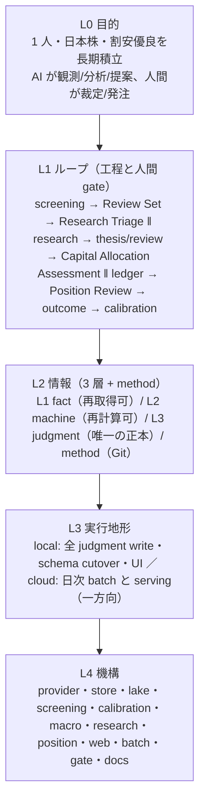

# Architecture

Baibai Loop は単一 distribution の中で、唯一の writer である `baibai_engine`、read-only presentation の `baibai_web`、non-request-driven orchestration の `baibai_batch` を分離する。application data は application DB、再生成可能な分析結果は専用 store、production methodology と presentation config は Git を正本とする。

実行・開発・運用環境は Ubuntu Linux のみをサポートする。CI と運用scriptも Ubuntu、POSIX path、GNU/Linux filesystem primitive を前提とし、Windows / macOS 向けの互換層は持たない。

```text
baibai-loop/
├── engine/src/baibai_engine/
├── web/
│   ├── backend/src/baibai_web/
│   ├── frontend/
│   ├── edge/
│   ├── contracts/
│   └── config/
├── batch/src/baibai_batch/
├── tools/
├── method/{macro,screening,research}/
├── stores/{application,market,macro,screening}/
├── reports/{studies,published,operations}/
├── docs/
├── .agents/
└── .github/
```

この文書は、システムの意味を上から順に 5 層で固定し（§1）、下の層が上の層に仕えているかを判定する基準（4 役）を置く。§2〜§5 は各層の正本、§6 は無人経路の停止条件、§7 は開発 gate である。

<a id="layers"></a>

## 1. 5 層モデルと 4 役

既存の file 構造から出発せず、このシステムの意味を上から順に固定する。下の層は上の層に仕える場合だけ存在してよい。



**L0 目的** は [`doctrine.md`](./doctrine.md) §1 のとおり。成果は注文数でなく、永久損失を避けながら最も割安な候補を人間が納得して判断できること、その見積り精度を 3 年 / 5 年で改善できること。

<a id="four-roles"></a>

### 4 役の判定基準

L4 の各機構（package・store・gate・workflow・doc）は、L1 のどの工程に対して次の 4 役のどれを担うかを 1 文で名指せなければならない。名指せる機構はその 1 文を module docstring に置く。

| 役 | 意味 | 例 |
| --- | --- | --- |
| **産む** | 工程の成果物を作る。無いと成果物が出ない。成果物を安く作るための cache key もここ | provider 取得、screening run、thesis promote、ledger apply、view export、`extractor_revision` |
| **止める** | 停止条件 2 つ（[必須入力が無い／出力が壊れる](#failure-policy)）または T2 の誤判断をその場で止める | coverage 検査、hydrate の行数一致、pointer CAS、thesis の evaluate、apply の append head 再検証 |
| **測る** | 柱 5 の計測経路（見積り vs 実現） | calibration panel / forward / evaluate、portfolio outcome |
| **見せる** | 人間が読む面 | read model、UI、Discord の 1 行、`--help` |

4 役のどれでもないもの — provenance・lineage・identity・drift 検査・語彙検査・規則の運用・「将来の安全」 — は既定で持たない（[`doctrine.md#improvement-value-hierarchy`](./doctrine.md#improvement-value-hierarchy) の T4）。持つ場合は人間の実損か T1〜T3 への検証可能な寄与を module docstring に書く。「将来使う」「安全のため」「監査できる」は 4 役ではない。

## 2. L1 ループと人間 gate

trigger 起点の運用は 6 つで、それぞれ 1 skill が手順・gate 順・停止条件を持つ（[`AGENTS.md`](../AGENTS.md) の「運用の入口」）。人間 gate は 4 つあり、機械はその手前で止まる。

| 運用（skill） | 工程 | 人間 gate |
| --- | --- | --- |
| `research-triage` | screening run → Review Set → Research Triage publish | Research Triage の `research` → Research Set の admission |
| `research` | workspace → thesis / review → Capital Allocation Assessment → ephemeral plan-limit | buy / defer / reject と broker 操作 |
| `ledger-record` | broker fact → ledger draft → apply | `position apply-draft --confirmed` |
| `position-review` | 決算・material event → Position Review → action | Position Review の publish |
| `macro-context` | indicator refresh → reading → context publish | —（非 gating の ambient 入力。判断層にだけ効く） |
| `ops-maintenance` | store transfer・publish・復元・定期 maintenance | — |

Candidate Discoveryからhuman-confirmed ledgerまでの責務境界は次のとおり。

```text
Universe → Security Analyses                 screening
Security Analyses → Nominations              4 Valuation Approaches
Nominations → Review Set                     overlap-first composition + capacity
Review Set → Research Triage                 research-worthiness judgment
Research Triage → Research Set               human admission
Research Set → Thesis / Independent Review   fundamental research
Theses → Capital Allocation Assessment       alternativesの統合判断
Capital Allocation Assessment → plan-limit   ephemeral decision input
human report → Ledger                        broker fact
```

4つのValuation Approachは固有の企業価値座標でNominationを作る。Review Set composerは複数approachの支持、方法内順位、6/5/5/4のrepresentation target、最大20件だけを所有し、E[r]をmembership/orderへ使わない。Research Triageが`research / skip`を判断し、人間が`research`の部分集合をResearch Setへadmitする。`research prepare --research-triage-id`はcanonical Research Triageへ束縛する。

<a id="information-layers"></a>

## 3. L2 情報

情報は 3 層 + method に分かれ、層が「失ったときにどう戻るか」を決める。

| 層 | 正本 | 失っても | 例 |
| --- | --- | --- | --- |
| L1 fact | R2 の L1 release（market）、`stores/macro/macro.sqlite` | provider から再取得（購読窓の外は不可 — これが lake を持つ唯一の理由） | 日足・財務・calendar・EDINET・JPX flag・macro series |
| L2 machine | run store・calibration store・macro reading | 再計算 | screening run・Security Analysis・Review Set・E[r]・FV anchor・macro reading・current calibration snapshot |
| L3 judgment | application DB | **失えない** | macro context・Research Triage・thesis / review・Capital Allocation Assessment・ledger・Position Review・outcome・task・session |
| method | Git | — | rules・reading rules・playbooks |

帰結: L3 以外は全部 cache であり、cache の identity・lineage・世代管理は「再計算すれば戻る」以上の価値を持たない。L1 fact の保持だけは購読窓の外側で失われるため、L1 release の不変性と差分転送は本質に入る。L2 machine は observed / derived / estimate を区別し、judgment と呼ばない。L3 は人間境界を write-time に検証する。fact / estimate / judgment の語彙と禁止事項は [`doctrine.md#fact-analysis-separation`](./doctrine.md#fact-analysis-separation) を正本とする。

### Store authority

store の所有者はこの表が唯一の正本である。

| store | 層 | contents | write owner |
| --- | --- | --- | --- |
| `stores/application/baibai.sqlite` | L3 judgment（canonical application DB） | task、macro context、Research Triage、thesis revision、Capital Allocation Assessment、Position Review、ledger event / price / meta、outcome、operation session | `baibai-engine` application service |
| R2 `lake/`（L1 release） | L1 fact（market の canonical authority） | lake 所有 dataset の immutable Parquet object・dataset manifest・release manifest・current pointer | `publish-lake`（cloud daily batch とローカル） |
| `stores/market/market.sqlite` | L1 fact の runtime copy + 2 data table の canonical | lake所有17 data tableはL1 releaseからのruntime copy、残る2 data table（取得範囲の帳簿 `source_coverage` と operator 導出の `tse_capital_policy_snapshots`）はここがcanonical、`lake_store_origin`はstore-local metadata | market / screening provider、`lake hydrate` |
| `stores/screening/runs.sqlite` | L2 machine（rebuildable run store） | 最新数世代を保持するprunable Security Analysis / Review Set cache | screening service |
| `stores/screening/calibration/current.sqlite` | L2 machine（rebuildable current snapshot） | typed calibration panel / diagnostics / forward outcome | screening calibration service |
| `stores/macro/macro.sqlite` | L1 fact（rebuildable） | provider 別 macro indicator series。manual 観測は git seed から同期 | macro indicator service |

一つの dataset が同時に二つの canonical writer を持たない。市場 fact の canonical authority は R2 の L1 release にあり、`market.sqlite` はその fixed release から削除・再構築できる runtime copy である。lake の publication contract（manifest・pointer・version 語彙・fail-close の条件）は [`reference/market-lake.md`](./reference/market-lake.md#market-lake-publication-contract) を正本とする。

application DB の default path は `stores/application/baibai.sqlite` で、`BAIBAI_DB` または各 CLI の `--db` で差し替えられる。runtimeはcurrent schemaを新規作成するか、異なるversionを拒否する。semantic cutoverはbackupから明示的に行う。監査tableとtransition historyは持たない。

Git に残す `method/` は `screening/rules`、`macro/reading`、`research/playbooks` の production methodology である。Macro panel の表示 group は `web/config/macro-panel.yaml` が所有する。application data を GitHub Issue や YAML file に複製しない。

<a id="cloud-serving-layer"></a>

## 4. L3 実行地形

judgment を書くのは local だけで、cloud は machine store と serving view だけを書く。judgment は local が書き、cloud へは replica として publish する。クラウド閲覧と日次機械工程は、ローカルのwriter/read-only境界を変えずに次の一方向経路で構成する。

```text
local baibai.sqlite ──publish──┐
                              v
GitHub Actions compute <──> R2 baibai-stores
          │                    market/runs/macro正本 + baibai replica
          │ materialize
          v
R2 baibai-serving ──binding──> Cloudflare Worker ──> browser
views + history + system        Bearer認証 + static UI
```

この経路で止まってよい条件は [Failure policy](#failure-policy) の 2 つだけである。bucket と object key の契約、workflow、credential の境界、publish / pull / 復元 / rotation の手順は [`batch/OPERATIONS.md`](../batch/OPERATIONS.md) を正本とする。

<a id="repository-map"></a>

## 5. L4 機構表

package ごとに、所有する store、public CLI、L1 のどの工程にどの役で仕えるか、何で止まるか（無人経路なら [Failure policy](#failure-policy) の条件 1 / 2、判断の write 経路なら人間 gate）を示す。役は §1 の 4 役の語だけを使う。

| package | store | CLI | 仕える工程と役 | 停止条件 |
| --- | --- | --- | --- | --- |
| `foundation` | — | engine 内部 | 全工程の **産む** に共通 primitive（path・時刻・JSON parser・repository layout）を供給する | — |
| `market` | R2 `lake/`、`stores/market/market.sqlite` | `baibai-engine lake` | L1 保持を **産む**（全 partition 導出の lake export・release manifest・pointer・hydrate）、**止める**（digest 一致・行数一致・pointer CAS・schema version）、**見せる**（`lake resolve`） | 2 |
| `macro` | `stores/macro/macro.sqlite`、application DB（context） | `baibai-engine macro` | macro を **産む**（indicator refresh・reading・context publish）、**止める**（context の schema 構造・引用解決・確率の合計・head CAS）、**測る**（scorecard 条件の機械照合）、**見せる**（reading・Macro view） | 1（series）、2（context の head） |
| `screening` | `stores/screening/runs.sqlite`、`stores/screening/calibration/`、application DB（Research Triage）、`market.sqlite` | `baibai-engine screening` | L1取得とscreeningを **産む**（provider取得・run・Security Analysis・Review Set・Research Triage publish）、**止める**（coverage・PIT・rules identity・Review Set / Triage束縛）、**測る**（current calibration panel / forward / evaluate）、**見せる**（Review Set YAML・Security Analysis view） | 1、2 |
| `research` | application DB | `baibai-engine research` | research を **産む**（workspace・thesis / review・promote・planning-only limit・Capital Allocation Assessment）、**止める**（evaluate・review hash 束縛・buy の human override 必須・`max_acceptable_price`）、**見せる**（assessment view） | 人間 gate（T2） |
| `position` | application DB | `baibai-engine position` | ledger と保有を **産む**（draft / apply・Position Review・outcome）、**止める**（append head CAS・保有超過拒否・人間確認必須）、**測る**（outcome vs TOPIX）、**見せる**（Dashboard） | 人間 gate（T1） |
| `operation` | application DB | `baibai-engine operation` | trigger ごとの session と checkpoint・human_confirmation を **産む**、**止める**（active 最大 1 件・complete 要件）、**見せる**（Dashboard の「いま何が途中か」） | — |
| `tasks` | application DB | `baibai-engine task` | 日付つき運用 task を **産む**、**見せる**（`task list`・Dashboard） | — |
| `appdb` | application DB | `baibai-engine db` | application DB のpath・current schema・writer connectionを **産む**、**止める**（schema version） | 2 |
| `read_api` | —（read-only） | engine 内部 | 全工程を **見せる**（query-only view）、materialize の前提を **止める** | 2 |
| `baibai_web` | —（read-only） | `baibai-web` | 判断面を **見せる**（read model・UI・materialize・Worker）、**止める**（read-only・Bearer） | 2 |
| `baibai_batch` | R2 `baibai-stores` / `baibai-serving`（transfer） | repository-internal `baibai-batch` | 日次機械工程を **産む**（fetch → screen → Review Set → export → publish・materialize・store transfer）、**止める**（exit code・2 条件）、**見せる**（Discord・watchdog） | 1、2 |
| `tools` | — | — | 開発 gate で **止める**（`quality/drift`）、一時的studyで **測る**（`experiments`）、deploy診断を **産む**（`diagnostics`） | — |

engine は web / batch / tools に依存しない。Web が engine へ触れる経路は `read_api`、batch は `batch_api` と `read_api` に限定し、その不変条件は import-linter で検査する。read-only Web の実行時契約は `web/backend/src/baibai_web/__init__.py` の module docstring、store 欠損時に reader が止まるか空を返すかは [Failure policy](#failure-policy) を正本とする。

### CLI

安定した利用者向け entry point は次の2本である。

- `baibai-engine <domain> <command>`: query と application service 経由の write
- `baibai-web`: local read-only UI

`baibai-batch` は GitHub Actions と運用 script が production job を呼ぶための repository-internal entry point で、domain の利用者向け surface ではない。

主要 domain は `lake / screening / macro / operation / position / research / task / db`。lake CLIはcurrent L1 releaseのpublish・resolve・hydrate・retentionだけを扱う。schema field、option、stdout YAML は public `--help` と engine modelを正とする。

### L3 judgment の write 規則

- canonical entity の作成・更新は DB transaction 内で current source と domain invariant を検証する。
- thesis / thesis review と Position Review は immutable revision。source thesis revision への束縛を弱めない。
- buy assessmentは判断根拠だけを持ち、価格・数量・expiryは保存しない。broker factは人間報告後だけledger draftへ変換できる。
- ledger は append-only eventを `(occurred_at, same_instant_order)` でreplayする。既存event IDとlegacy decision referenceは保存し、新規eventを遡及挿入してcurrent snapshotを再計算できる。
- canonical ledger mutationは draft生成と、人間確認後の `position apply-draft --confirmed` を分離する。applyはexpected append head、assessment / reservation binding、置換対象rowを同一transactionで再検証する。
- operation sessionは複数stepの `capital-allocation` / `position-review` 全体でactive最大1件。active rowのcurrent payloadを置換し、complete時に同じrowをimmutable final recordにする。checkpoint historyやtransition logは持たない。単発のledger / outcome writeはdomain command自身がhuman boundaryを持つ。

<a id="failure-policy"></a>

## 6. Failure policy

無人で走る経路（日次 batch・hydrate・publish・materialize）と、publish 済みの内容を答える reader が止まってよいのは、次の 2 条件のどちらかに当たるときだけである。

1. **必須入力が無い** — その日の判断に要る行が store に無く、取得もできなかった。screening は cache-only なので、無いものは計算できない。
2. **出力が壊れる** — 進めると次の読み手が壊れた store・release・view を受け取る。行数・population の床割れ、履歴の後退、schema version の不一致、manifest / object digest の不一致、pointer CAS の競合、httpfs の欠如、壊れた query がこれに当たる。

それ以外では止めない。鮮度（age・staleness・lead）は reader が軸を null にする。producer の identity（fingerprint・revision）の変化は停止理由ではなく作り直しの契機である。1 record の異常（衝突・欠落）は当該 record を落として続ける。publish 済みの内容を答える reader は未作成fileまたはtableを一つも持たないunwritten storeを空 viewとして返す。既存storeのschema version不一致とcurrent schemaのtable欠損は壊れた出力を防ぐためraiseする。書き込みを門番する reader（`market_calendar_business_day`、`previous_run_revision_id`）はunwritten storeも条件2としてraiseする。この規則は `tests/engine/test_read_api_degrade.py` が全 public reader を走査して守る。

degrade の報告経路は batch の exit 3（Discord `[DEGRADED]`）の 1 本で、新しい語彙・field・指標・gate を足さない。exit 3 は GHA の job を赤にしないので、GHA の赤はその日の成果物が出なかったことだけを意味する。blocking guard を足す PR は 2 条件のどちらに当たるかを本文で述べ、述べられないなら足さない。guard を消す PR は、窓内の発火を 1 件ずつ原因と修正 PR へ帰属させる — 「自然解消した」は、同日に修正が merge されていないことを確かめてから言う。完走率が要るときは定時 run だけで数える（[`batch/OPERATIONS.md`](../batch/OPERATIONS.md#欠測の検知cloud-batch-watchdog)）。

## 7. Development gates

機械契約はDB constraint、pydantic model、application service validationとnegative testで守る。write 時の検証層は次の4つ:

| layer | responsibility |
| --- | --- |
| SQLite constraint / trigger | required identity、enum、foreign key、immutable row、active最大1件 |
| pydantic / domain model | field type、shape、cross-field invariant |
| application service | current source、revision、assessment / reservation、人間確認、stale no-write |
| config loader | Git管理のscreening rules、Macro panel config、playbookの構造 |

高影響のDB変更では正常系だけでなく、conflicting ID、invalid enum、missing reference、revision drift、stale draft、人間確認なし、read-only appからのwrite不能をtestする。ledgerはevent順序、snapshot全field、market price / override / metaをfixtureと比較する。schema fileやlive YAML treeを横断するvalidator CLIは置かず、保持すべきruleは各write pathのnegative testで反証する。

通常のgateは `ruff format --check`、`ruff check`、`mypy`、`pytest`、import-linter、frontend build。Python gate の完全形と再現手順は [`reference/python-foundation.md`](./reference/python-foundation.md) §9、UI・Cloudflare Worker・security（Bandit / pip-audit / npm audit）を含む全 CI job は `.github/workflows/`（`ci.yml` / `web.yml` / `security.yml`）を正本とする。設定fileはloader testで検証する。
