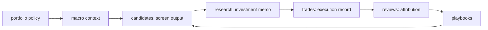

# System overview

Baibai-Loop は、日本株スイングトレードの判断を forward-only に記録し、改善するための decision-support 基盤です。目的は「お買い得銘柄を拾う最適な取引戦略」を、候補発見、証拠評価、position sizing、実行可否、review attribution、playbook feedback の loop で改善することです。

正準の概念モデルは [`../concepts.md`](../concepts.md) を参照します。この doc では repository path と concept label を併記します。

| Concept | Repository location | レイヤー | 役割 |
| --- | --- | --- | --- |
| portfolio policy | [`docs/portfolio-policy.md`](../portfolio-policy.md) | governance | 目的、制約、資本、許容リスク、time horizon を固定する |
| macro context | `records/01-macro-context/` | analysis | 外部記事と統計 series を参照し、screening 前の市場環境を判断する |
| screen output | `records/04-candidates/` | fact | universe と screening rule から ticker-level raw screen output を記録する |
| investment memo | `records/05-research/` | analysis | candidates と macro context を統合し、thesis payoff と採用可否を判断する |
| execution record | `records/06-trades/` | execution | 実際に order / entry した採用判断の注文、約定、建玉、決済を記録する |
| attribution review | `records/07-reviews/` | feedback | relative return、missed opportunity、playbook attribution で feedback loop を閉じる |

## Decision Loop

Macro context は screening 手前で確認し、必要に応じて深く更新します。Security-level track は `candidates -> research -> trades -> reviews` で売買判断と feedback を扱います。統合点は investment memo です。

`policy weight` としての macro 76 / security-level 24 は廃止します。Validator-visible な採用可否と sizing cap は portfolio policy と research 判断が担います。

## スコープ

- 基本は 2 か月以内、5-40 営業日のスイングトレードを対象にする。ただし、短期 thesis が外れた場合に長期保有へ切り替えられる銘柄を優先する policy を持つ。これは主戦略の holding period を延ばすためではなく、含み損時に損失確定を急がず、資産ロックを受け入れて回収を待てる selection principle である。
- long-only の裁量支援基盤として扱う。
- Macro context は hard gate ではなく、screening / research の確認観点として扱う。
- Markdown / YAML と Git を正本にする。
- AI 下書きと人間確認を前提に、事実層と分析層を物理的に分ける。
- CLI は screening、validation、ledger sync、macro statistics 取得の補助に使う。
- decision register と reviews は forward-only な検証証跡として扱う。

## 非目標

- バックテスト、累積リターン計算、パラメータ最適化は行わない。
- 自動発注は行わない。
- screening 閾値や playbook を過去データに fit させない。
- 配当利回り単独の playbook / Rerating Book は対象外にする。配当・自己株買いは、long-hold fallback 時の資産ロック中に収益が見込める preference として research で確認する。
- 汎用 feature store / BI 基盤を先行導入しない。SQLite は screening input の local canonical
  store と、macro statistics 取得の local cache としてだけ使う。

詳細な rationale は [`../philosophy.md`](../philosophy.md)、実践ルールは [`../design-principles.md`](../design-principles.md)、成果物ごとの contract は [`../components/README.md`](../components/README.md) を参照します。
