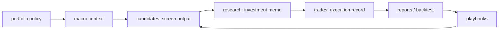

# System overview

Baibai-Loop は、日本株の実データを機械的に収集・解析・スコアリングし、その効果を forward 計測で検証し続けるデータ解析基盤です。目的は「お買い得銘柄を拾う最適な取引戦略」を、候補発見、証拠評価、position sizing、実行可否、forward 計測 (ledger + reports)、playbook feedback の loop で改善することです。

## 3 層モデル

| 層 | 実体 | 性質 |
| --- | --- | --- |
| L1 データ層 | `data/screening/market.sqlite`(J-Quants 価格・財務 / EDINET metrics / JPX 規制) | 全上場銘柄の再現可能な事実。coverage は fail-fast で検証する |
| L2 分析層 | screen lanes([`../screening/mechanical.md`](../screening/mechanical.md))・selection lenses・軸別スコア・forward telemetry(replay / lane cohorts / ablation) | 決定論的・閾値固定。すべて forward 計測に接続する([`../screening/extending.md`](../screening/extending.md)) |
| L3 判断層 | `records/`(research / trades、macro context) + `reports/` (ad-hoc forward 計測まとめ) | 人間 + AI 下書きの解釈と判断。売買 record が L2 計測の ground truth を供給する |

AI / スクリプトが利用する安定契約は CLI YAML 出力と SQLite schema の 2 面([`../reference/platform-interface.md`](../reference/platform-interface.md))。下表の decision loop は L3 の中を流れ、L1/L2 が全 stage に事実と計測を供給します。L2 の「分析」は決定論的な機械処理であり、その出力(下表で fact レイヤーと記す candidates)は事実として扱います。人間/AI の解釈を伴う analysis レイヤー(macro context、investment memo)は L3 に属します。

正準の概念モデルは [`../concepts.md`](../concepts.md) を参照します。この doc では repository path と concept label を併記します。

| Concept | Repository location | レイヤー | 役割 |
| --- | --- | --- | --- |
| portfolio policy | [`docs/portfolio-policy.md`](../portfolio-policy.md) | governance | 目的、制約、資本、許容リスク、time horizon を固定する |
| macro context | `records/01-macro-context/` | analysis | 外部記事と統計 series を参照し、screening 前の市場環境を判断する |
| screen output | `records/04-candidates/` | fact | universe と screening rule から ticker-level raw screen output を記録する |
| investment memo | `records/05-research/` | analysis | candidates と macro context を統合し、thesis payoff と採用可否を判断する |
| execution record | `records/06-trades/` | execution | 実際に order / entry した採用判断の注文、約定、建玉、決済を記録する |

## Decision Loop

Macro context は screening 手前で確認し、必要に応じて深く更新します。個別銘柄 lifecycle は `candidates -> research -> trades -> reports` で売買判断と forward 計測 feedback を扱います。統合点は investment memo、forward 計測の正本は [`../operations/backtest-runbook.md`](../operations/backtest-runbook.md) です。

採用可否と sizing cap は portfolio policy と research 判断が担います。Macro context は hard gate ではなく、screening 前提と sector 優先度を整理する入力です。

## スコープ

- 基本は 2 か月以内、5-40 営業日のスイングトレードを対象にする。ただし、短期 thesis が外れた場合に長期保有へ切り替えられる銘柄を優先する policy を持つ。これは主戦略の holding period を延ばすためではなく、含み損時に損失確定を急がず、資産ロックを受け入れて回収を待てる selection principle である。
- long-only の裁量支援基盤として扱う。
- Macro context は hard gate ではなく、screening / research の確認観点として扱う。
- Markdown / YAML と Git を正本にする。ただし週次 screen output(candidates YAML)は再生成可能な L2 機械出力として local store に置き、git には積まない([`../components/candidates.md`](../components/candidates.md) §2)。
- AI 下書きと人間確認を前提に、事実層と分析層を物理的に分ける。
- CLI は screening、selection、validation、ledger sync、forward 計測(replay / lane cohorts / ablation)、macro statistics 取得に使う。
- decision register と reports/ の forward 計測まとめは forward-only な検証証跡として扱う。

## 非目標

- バックテスト最適化、パラメータ探索は行わない(行うのは記録済み output の forward 計測のみ)。
- 機械学習によるスコアリング・予測は行わない。スコアは軸別の座標として出し、単一の合成点や売買指示には畳まない。
- 自動発注、リアルタイム処理は行わない。
- screening 閾値や playbook を過去データに fit させない。
- 配当利回り単独の playbook / Rerating Book は対象外にする。配当・自己株買いは、long-hold fallback 時の資産ロック中に収益が見込める preference として research で確認する。
- 汎用 feature store / BI 基盤、MCP / API server などのサービング層は導入しない。SQLite は market data の local canonical store として使い、AI は CLI と SQL で直接読む。

詳細な rationale は [`../philosophy.md`](../philosophy.md)、実践ルールは [`../design-principles.md`](../design-principles.md)、成果物ごとの contract は [`../components/README.md`](../components/README.md) を参照します。
