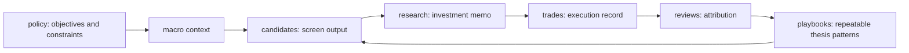

# Investment decision concepts

Baibai-Loop は、self-directed な投資判断を forward-only に記録し、あとから検証できるようにするための repository です。投資助言サービス、委任運用システム、規制 compliance system ではありません。IPS や books-and-records 的な考え方は、自己運用の裁量判断を一貫させ、あとから振り返れるようにするための運用規律として借ります。

目的は、ビジネス価値、つまり「お買い得銘柄を拾う最適な取引戦略」を長期的に改善することです。用語整理は目的ではなく、候補発見、証拠評価、position sizing、実行可否、review attribution、playbook feedback を一貫して扱うための土台です。

この decision loop は、データ層(L1: `market.sqlite`)と分析層(L2: 機械的 screen / lens / スコア / forward telemetry)の上で動く判断層(L3)です。3 層モデルの正本は [`architecture/system-overview.md`](./architecture/system-overview.md) を参照してください。

## Decision Loop

| Stage | Responsibility | Primary question |
| --- | --- | --- |
| policy | objectives and constraints | 何を許し、何を禁じ、どの資本と時間軸で判断するか |
| macro context | macro / sector context | 今の市場環境をどう読み、screening 前に何を確認するか |
| candidates | screen output | どの銘柄が mechanical screen に残ったか |
| research | investment memo | thesis, risk/reward, invalidation を満たすか |
| trades | execution record | order / entry した判断がどう約定・保有・決済されたか |
| reviews | attribution | 結果を何に帰属し、次回何を直すか |
| playbooks | repeatable thesis patterns | どの thesis pattern を強める / 弱める / 改訂するか |

## Five Questions

各 artifact は 5 つの問いで説明します。これは完全な直交制約ではなく、混同を防ぐための conceptual model です。

| 問い | 意味 | 例 |
| --- | --- | --- |
| Responsibility | 何を担う artifact か | observation, view, screen output, investment memo, execution, attribution |
| Granularity | どの粒度を扱うか | macro, market, sector, security-level, portfolio |
| Evidence family | どの種類の証拠を使うか | macroeconomic, policy/geopolitical, fundamental, valuation, market-derived, positioning/liquidity, catalyst |
| Evidence quality / provenance | 証拠の品質・出所・鮮度をどう扱うか | source URL, source status, freshness warning, lineage, repository refs |
| Decision role | 判断にどう効くか | input, screen, gate, thesis evidence, risk overlay, trigger, attribution |

これらの問いは部分的に相関します。たとえば macro 粒度では macroeconomic evidence family が多く、security-level では fundamental / valuation evidence が多くなります。Baibai-Loop は 5 つの問いを直交制約として強制せず、artifact を読むときの整理軸として使います。

## Repository Lifecycle Labels

Baibai-Loop は次の concept label で repository lifecycle を説明します。

| Concept label | Repository location |
| --- | --- |
| portfolio policy | [`docs/portfolio-policy.md`](./portfolio-policy.md) |
| macro context | `records/01-macro-context/` |
| security-level screen output | `records/04-candidates/` |
| investment memo | `records/05-research/` |
| execution record | `records/06-trades/` |
| research decision and tracking register | `records/_ledger/` |
| repeatable thesis patterns | `records/_playbooks/` |

`portfolio policy` は governance component としてこの docs set に置きます。現在の lifecycle では、capital / risk / liquidity の判断条件を research、ledger、trades の各 artifact に記録される field で確認します。履歴が必要な場合は git で確認します。

Long-lived context は main lifecycle には含めません。Slow-moving context を扱う場合は、macro context / research へ重複保持せず、lifecycle 外の参照層として扱います。

## Responsibility Boundaries

- `portfolio policy` は目的、制約、資本、許容リスク、time horizon、eligible universe、kill switch、swing-first / long-hold-capable value principle を扱います。具体的な銘柄 thesis や entry / invalidation / exit は playbook / investment memo が扱います。
- `macro context` は analysis layer です。外部記事と統計 series を参照し、screening 前の macro / sector context を読みます。記事本文や監査ログは保存しません。
- `candidates` は screen fact layer です。ticker-level の pinned repository file を残し、後続の current decision state は上書きしません。
- `records/_ledger/` は research decision と tracking event を append-only に記録する正本です。Candidate は screen fact、trades は execution record、reviews は attribution record として分けます。
- `research` は investment memo です。Evidence count だけでなく、entry、target、stop、expected upside / downside、risk/reward、time horizon、invalidation conditions を検証します。
- `trades` は execution record です。実際に order / entry した採用判断を扱い、発注しなかった採用・見送り・保留を trade と呼びません。
- `reviews` は outcome attribution / feedback layer です。Absolute return だけでなく relative return、missed opportunity、evidence hit outcome、macro context attribution、sizing attribution、execution attribution、playbook feedback を扱います。

## Evidence Taxonomy

`evidence family` は Baibai-Loop 内部の taxonomy です。Fama-French などの systematic risk factor ではなく、investment memo で thesis を検証するための analytical lens / return driver に近い概念です。

Artifact-level では `macroeconomic`, `policy/geopolitical`, `fundamental`, `valuation`, `market-derived`, `positioning/liquidity`, `catalyst` を扱います。

Candidate-level / investment memo の evidence hit では、原則として `fundamental`, `valuation`, `market-derived`, `positioning/liquidity`, `catalyst` に限定します。`macroeconomic` と `policy/geopolitical` は macro context 側で扱います。Schema enum では `market_derived` / `positioning_liquidity` のような ASCII-safe な値を使い、docs 表示名では hyphen / slash を使ってよいです。

`technical` は正準 evidence family ではありません。価格、相対強度、出来高など市場から観測される情報は `market-derived evidence` と呼びます。Short interest、信用残、ADV、特別注意銘柄、流動性制約などは `positioning / liquidity evidence` と呼びます。

## Feedback Loop

Review / retro は勝敗の件数集計ではありません。Outcome を playbook、evidence family、macro context、sizing、execution に帰属させ、次の screening と investment memo を改善する feedback loop です。

見送り、保留、採用したが発注しなかった候補も、missed opportunity として追跡対象になります。Screening が拾わなかった銘柄の網羅監査は current lifecycle から外し、必要になった時点で別 issue / PR として再導入します。

この feedback loop が、schema / docs の変更を business value に接続する中心です。
