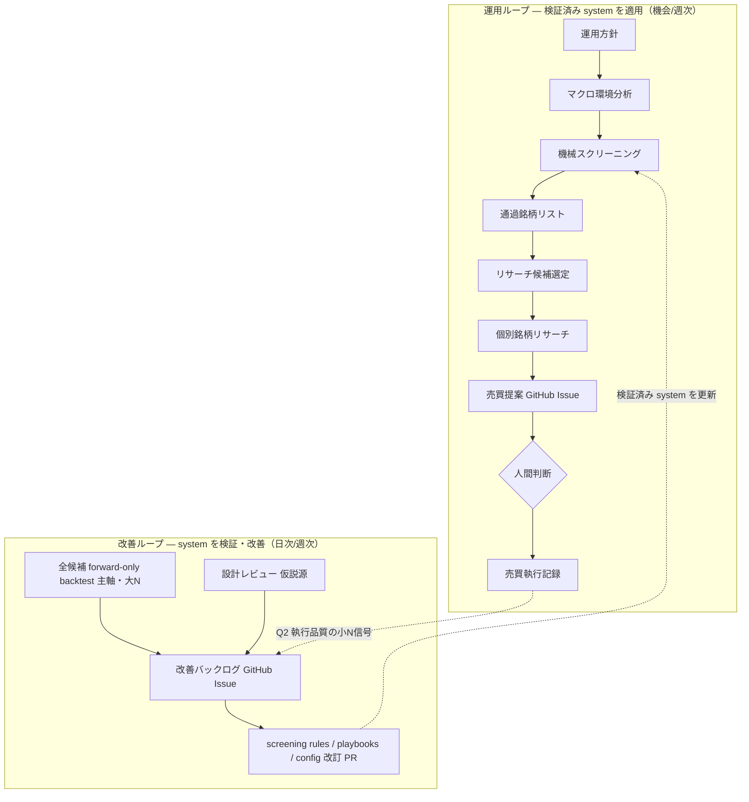

# Investment decision concepts

Baibai-Loop は、日本株の self-directed な売買判断を forward-only に記録・改善するための repository です。投資助言サービス・委任運用システム・規制 compliance system ではありません。IPS や books-and-records 的な考え方は、自己運用の裁量判断を一貫させ、あとから検証するための運用規律として借ります。

目的（ビジネス価値）は「お買い得銘柄を拾い、トレード成績を最大化する」ことです。この目的のために、Baibai-Loop は **性質の違う 2 つのループを意図的に分離して**回します。

## 2 つのループ（中心モデル）

Baibai-Loop は単一ループではありません。「検証済みの screening system を**適用**して売買する運用ループ」と、「その system を**検証・改善**する改善ループ」を分けます。分ける理由は次節「なぜ分けるか」です。

両ループの接合点は **「検証済みの screening system（rules / playbooks / config）」ただ 1 点**です。改善ループがそれを更新し、運用ループが現行版を消費します。カデンス・データ源・成果物・管理面はすべて別です。

### 運用ループ（機会ごと・週次）

検証済み system を適用して、具体的な売買判断（どの銘柄を・いくらで・何株）まで落とす。screening 論理そのものは改善しない。

| Stage（日本語概念名 / slug） | 役割 | 主な問い |
| --- | --- | --- |
| 運用方針 (portfolio policy) | 目的・制約・資本・許容リスク・time horizon を固定する | 何を許し、何を禁じ、どの資本・時間軸で判断するか |
| マクロ環境分析 (macro context) | screening 前の市場環境を読む | 今の市場環境をどう読み、何を確認するか |
| 機械スクリーニング (screening) | 4 playbook の OR で通過銘柄を機械抽出する | どの銘柄が機械ふるいに残るか |
| 通過銘柄リスト (candidates) | 通過銘柄の事実 snapshot | （事実。解釈を入れない） |
| リサーチ候補選定 (select) | lens で着手候補を絞り順位付けする | どの候補から深掘りするか |
| 個別銘柄リサーチ (thesis) | thesis・risk/reward・invalidation を判断する投資メモ | 採用に値するか |
| 売買提案 (trade proposal) | 最終選考銘柄の詳細 ＋「いくらで何株」を GitHub Issue で提案する | 何を・いくらで・何株 買うべきか |
| 〔人間判断〕 | 提案を承認 / 修正 / 却下する | 実弾を入れるか |
| 売買執行記録 (position) | 注文・約定・保有・決済を記録する | 採用判断がどう約定・保有・決済されたか |

### 改善ループ（日次/週次）

screening system が「うまく機能しているか」を検証し、改善する。**主軸は全候補母集団の forward-only backtest**（大 N）。設計レビューは仮説源、trades は執行品質（Q2）の信号として入る。改善項目は **GitHub Issue の改善バックログ**で管理し、screening rules / playbooks / config の改訂（PR）に落とす。`reports/` はその計測の dated ダイジェスト。

### なぜ 2 つに分けるか — 3 つの問いと母数

性質の違う 3 つの問いを **直交する別問い**として分けます（同一標的の多面測定ではありません）。

| 問い | 検証対象 | データ源 | N | 計器 | 帰属 |
| --- | --- | --- | --- | --- | --- |
| Q1 論理の質 | playbook / lens / regime が forward alpha を生むか | 全候補母集団の過去 replay | 大 | backtest（playbook-cohorts / replay / ablation） | 改善ループの主軸 |
| Q2 執行の質 | sizing / timing / exit / kill-switch を正しく運用したか | 自分の実トレード | 極小 | trade review ＋ judgment counterfactual | 改善ループへ Q2 信号として |
| Q3 個別 thesis | この銘柄の回帰が想定通りか | 個別トレード | n=1 | 事例学習（統計ではない） | 仮説源 |

要点: screening 論理の質（Q1）を測れる大 N の計器は **backtest ただ 1 つ**です。個人の実トレードは母数が極小で（実測で approved n=8 のとき 95% CI [−7.60, +0.32]）、screening の優劣を統計検証できません。だから **改善は trades からではなく backtest から駆動**し、trades は Q1 の測定ではなく Q2（執行品質）の信号として改善ループに還流します。設計レビューは測定ではなく Q1 へ投げる仮説源です。手順の正本は [`operations/backtest-runbook.md`](./operations/backtest-runbook.md)、規律は [`design-principles.md`](./design-principles.md) §9。

## 構成要素の呼称と種別（vocabulary）

人間向けには **日本語概念名**で呼び、slug（英語名）はディレクトリ名・CLI 名の識別子として残します。読み解く鍵は **「機械処理（engine ＝ 動詞）」と「成果物（artifact ＝ 名詞）」を区別する**ことです。

| 日本語概念名 | slug | 種別 | 層 | 役割 |
| --- | --- | --- | --- | --- |
| 市場データ基盤 | market.sqlite | データ store | L1 | 全上場銘柄の実データを集約した正本 |
| 機械スクリーニング | screening | 機械処理 | L2 | 4 playbook の OR 条件で通過銘柄を機械抽出する |
| 通過銘柄リスト | candidates | 成果物（事実） | L2 出力 | スクリーニング通過銘柄の事実 snapshot |
| リサーチ候補選定 | select | 機械処理 | L2 | 通過銘柄から着手候補を lens で絞り順位付けする |
| フォワード計測 | forward backtest | 機械処理 | L2 | 過去週 replay で playbook / lens / regime の効果を計測する |
| マクロ環境分析 | macro context | 分析（判断） | L3 | スクリーニング前の市場環境の読み |
| 個別銘柄リサーチ | thesis（investment memo） | 分析（判断） | L3 | thesis・採否・sizing を判断する投資メモ |
| 売買提案 | trade proposal（GitHub Issue） | 判断の入口 | L3 | 最終選考銘柄の詳細 ＋ 銘柄/価格/株数 提案を人間に上げる |
| 売買執行記録 | position（execution record） | 執行 | L3 | 注文・約定・保有・決済の記録 |
| 判断・追跡レジスタ | decision register（decisions） | 記録 | L3 | 売買提案・執行の決定イベントを機械正規化する |
| 計測レポート | reports | 解釈（判断） | L3 | 計測結果を解釈し、次の改訂方針を残す |
| 運用方針 | portfolio policy | governance | — | 目的・制約・資本・許容リスク・time horizon |
| 戦略プレイブック | playbooks | governance | — | 再現可能な thesis（投資仮説）の型 |

`research`（個別銘柄を調べる活動）と `thesis`（その成果物 = 投資仮説 packet, `records/05-thesis/`）は別語彙です。活動名「個別銘柄リサーチ」は残し、ディレクトリ・component の識別子には artifact 側の slug `thesis` を使います。

L1 / L2 / L3 の 3 層インフラ（データ / 機械的分析 / 判断の置き場所）と、2 つのループの関係は [`architecture/system-overview.md`](./architecture/system-overview.md) を参照します。**売買提案は GitHub Issue を成果物とし、records/ にディレクトリを持ちません**。承認結果は `records/_decisions/`（decision register）と `records/06-position/` に落ちます（Issue = 人間向けの提案 / 承認の場、decision register = その結果の機械正規化、と非重複）。

## artifact を読む 5 つの問い

各 artifact は 5 つの問いで説明できます。完全な直交制約ではなく、混同を防ぐための整理軸です。

| 問い | 意味 | 例 |
| --- | --- | --- |
| Responsibility | 何を担う artifact か | observation, screen output, investment memo, execution, attribution |
| Granularity | どの粒度を扱うか | macro, market, sector, security-level, portfolio |
| Evidence family | どの種類の証拠を使うか | macroeconomic, policy/geopolitical, fundamental, valuation, market-derived, positioning/liquidity, catalyst |
| Evidence quality / provenance | 証拠の品質・出所・鮮度をどう扱うか | source URL, source status, freshness warning, repository refs |
| Decision role | 判断にどう効くか | input, screen, gate, thesis evidence, risk overlay, trigger, attribution |

## Evidence Taxonomy

`evidence family` は Baibai-Loop 内部の taxonomy です。Fama-French などの systematic risk factor ではなく、investment memo で thesis を検証するための analytical lens / return driver に近い概念です。

Artifact-level では `macroeconomic`, `policy/geopolitical`, `fundamental`, `valuation`, `market-derived`, `positioning/liquidity`, `catalyst` を扱います。

Candidate-level / investment memo の evidence hit では、原則として `fundamental`, `valuation`, `market-derived`, `positioning/liquidity`, `catalyst` に限定します。`macroeconomic` と `policy/geopolitical` は macro context 側で扱います。Schema enum では `market_derived` / `positioning_liquidity` のような ASCII-safe な値を使い、docs 表示名では hyphen / slash を使ってよいです。

`technical` は正準 evidence family ではありません。価格・相対強度・出来高など市場から観測される情報は `market-derived evidence` と呼びます。Short interest、信用残、ADV、特別注意銘柄、流動性制約などは `positioning / liquidity evidence` と呼びます。

## 責務境界

- **運用方針 (portfolio policy)** は目的・制約・資本・許容リスク・time horizon・eligible universe・kill switch・swing-first / long-hold-capable value principle を扱う。具体的な銘柄 thesis や entry / invalidation / exit は playbook / investment memo が扱う。
- **マクロ環境分析 (macro context)** は analysis layer。外部記事と指標 series を参照し、screening 前の macro / sector context を読む。記事本文や監査ログは保存しない。
- **通過銘柄リスト (candidates)** は screen fact layer。ticker-level の pinned file を残し、解釈・予測・相場観を書かない。
- **個別銘柄リサーチ (thesis)** は investment memo。evidence count だけでなく、entry・target・stop・expected upside / downside・risk/reward・time horizon・invalidation を検証する。
- **売買提案 (trade proposal)** は research の採用結論を **portfolio 視点の具体提案**（どの銘柄を・いくらで・何株、集中度・timing を含む）に落とし、GitHub Issue で人間に上げる入口。発注しなかった採用・見送り・保留は trade ではない。
- **売買執行記録 (position)** は execution record。実際に order / entry した採用判断を扱う。
- **判断・追跡レジスタ (decisions)** は研究判断と執行イベントを append-only に正規化する正本。Candidate は screen fact、trades は execution として分ける。
- **フォワード計測 (backtest) / 計測レポート (reports)** は改善ループの計器とその解釈。backtest は決定論的な機械計測（L2）、reports はその数値を読んで「次に何を直すか」を残す解釈（L3）。手順は [`operations/backtest-runbook.md`](./operations/backtest-runbook.md)。

`portfolio policy` は governance component として docs set に置く。Long-lived context は main lifecycle に含めず、lifecycle 外の参照層として扱う。

## フィードバック（改善はどう駆動されるか）

改善ループは勝敗の件数集計ではありません。outcome を playbook・evidence family・macro context・sizing・execution に帰属させ、次の screening と investment memo を改善するためのものです。

- **主軸 = 全候補 forward-only backtest（Q1, 大 N）**。どの playbook / lens / regime が forward return を生んだかを、look-ahead を排した過去 replay で測る。
- **改善の管理 = GitHub Issue の改善バックログ**。トレード結果だけでなく設計レビューも入力になる多角的なバックログ（[root README](../README.md) の宣言と一致）。
- **trades = Q2（執行品質）の信号**。screening 論理の検証には使わない。見送り・保留・採用したが発注しなかった候補は missed opportunity として Q2 / opportunity-cost 計測の対象にする。
- backtest は proposal レベルの妥当性検証（株価回帰が想定通りか等）へ拡張し、過去 asof の取得は screening に必要なデータだけを on-demand に sqlite キャッシュする方向（手順・規律は [`operations/backtest-runbook.md`](./operations/backtest-runbook.md) と [`design-principles.md`](./design-principles.md) §9）。

このフィードバックが、schema / docs の変更を business value に接続する中心です。
