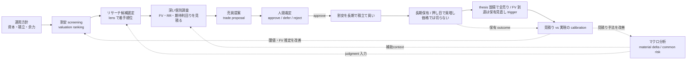

# Doctrine — Baibai-Loop の投資思想と大戦略

このリポジトリが **何を信じ、何を狙い、どの原則と語彙で判断するか** を定める正本。構造（3 層・engine/app package・CLI/SQLite 契約）は [`architecture.md`](./architecture.md)、資本とポジションの管理は [`portfolio-management.md`](./portfolio-management.md)、各運用の手順は [`.agents/skills/`](../.agents/skills/) の各 SKILL.md を参照する。

運用モデルは **AI 主導・人間裁定**：AI がマクロ経済を分析してトレンドを読み、市場で過小評価されているお買い得銘柄を機械抽出し、長期積立・配当還元を前提とした長期保有に耐える銘柄を個別にリサーチして売買提案まで作る。人間はその提案を判断し、発注する。Baibai-Loop はこの分業に一貫性を持たせ、判断を後から検証できるようにするための基盤であり、投資助言サービスではない。

人間はこの分業を Baibai App（`baibai-app`）で消費し、ダッシュボードで portfolio と提案の現状を把握し、macro context を理解し、screening 結果を確認したうえで個別銘柄researchと最終投資判断に進む。

最上位成果は予算消化や注文数ではなく、永久的な資本毀損を抑えながら、その時点で最も割安な候補を人間が納得して判断できることである。候補は永久損失、5年期待総合return/FV乖離、portfolioへの追加価値、購入可能性の順で比較する。資金目安、既存保有、予約は判断材料だが、価値順位を先に歪めない。

AIは観測・分析・提案に責任を持ち、人間は`approve / defer / reject`とbroker操作に責任を持つ。repositoryが保持するbroker factは人間が確認して報告したものに限る。AIは未報告の注文状態を補間せず、broker会計の完全再現を目的にしない。候補なし、購入見送り、価格超過によるdeferは正常な判断である。

## 1. 目的（このシステムで達成したいこと）

日々の暮らしの中で **お買い得な優良銘柄を探し、長期で積み立てる**（配当利回りがあればなお良い）。狙いの核心は「一時的に売られすぎた割安株を掴む」ことにあり、想定どおりに上がらなくても **塩漬けを許容できる銘柄だけを選ぶ**。

売却の主因は **事業のファンダメンタルズ毀損（thesis break）** である。**フェアバリュー到達は保有見直しの trigger であって自動の全売り命令ではない**：FV 到達時は thesis health（永久損失兆候・invalidation・証拠鮮度）と、税・費用を引いた代替機会の期待値を比べ、`hold / add / reduce / exit` を判断する。税引後で明確に勝る乗換先が無ければ、割高でも保有を続けてよい。**株価が下がったこと自体では売らない**（価格による損切りは置かない）。だからこそ、採用の時点で **塩漬け耐性**（ネットキャッシュまたは健全な財務・営業キャッシュフローの黒字・低い有利子負債・借換に耐える体力）を必須の関門にする（配当は加点材料であって必須条件ではない）。

お買い得を見つける手段は **マクロ経済分析 × 機械スクリーニング × 深い個別調査** の組み合わせで、そこから **リスクリワードと期待利回りを見積もる**。運用を通じて磨くべき中核の技能は、この **「本当に割安か」の見積りの精度** であり、長期の投資活動を続ける中で継続的に高めていく。

## 2. 運用モデル — 単一ループと見積りの改善

Baibai-Loop が回すのは 1 つの長期投資ループである。その中核技能（見積り）を実現結果と突き合わせて磨くフィードバックを、ループ自体に組み込む。

- **改善は重厚な別機構ではなく、運用に内蔵した calibration（見積りと実現の突き合わせ）で行う**。entry 時の見積り（リスクリワード・期待利回り・フェアバリュー）を実現結果（実際のリターン・利回り・valuation の収束・thesis の的中）と突き合わせ、外れた箇所（マクロの読みか、screening の閾値か、フェアバリュー推定か、耐性判定か）を一つずつ特定して見積り手法を改める。
- 突き合わせの母数は 2 系統ある。**(a) 自分の保有の実現結果**（件数は少ないが、一つひとつを長期に深く観測する。最終的な判断品質の正）と、**(b) 全銘柄の長期 horizon リプレイ計測**（過去の各時点で機械見積り・ランキングを再構成し、実現リターンと突き合わせる。見積り「手法」の較正用で、件数を桁で補う）。(b) の 3m/6m は regression alert、1y は leading evidence、production の実証的変更候補には 3y/5y の完全な evidence を必要とする（柱 5）。

### 改善提案の価値階層

基盤改善の提案と review 指摘は、次の直接的な成果により **T1 > T2 > T3 ≫ T4** の順で優先する。この階層は改善へ資源を配分する基準であり、銘柄比較における永久損失の関門や、一次情報確認・機械検算など現在の判断を正しくするための必須検証を弱めない。

| tier | 直接的な成果 | 採否の原則 |
| --- | --- | --- |
| **T1** | お買い得銘柄を拾える確率・精度を上げる。候補発見、FV / E[r] の見積り、個別 research の質を改善する | 最優先。実際の候補抽出または投資判断へ至る因果経路と、効果を確かめる計測を示す |
| **T2** | 誤った買いによる永久的な資本毀損を防ぐ。事業・財務・valuation の誤認や計算誤りを判断前に検出する | T1 に次いで優先。どの誤判断をどの検証で止めるかを示す |
| **T3** | 反復する運用の時間・費用・手戻りを減らす | T1 / T2 の作業量または判断までの時間を実際に減らせる場合に採用する |
| **T4** | 監査、再現性、復元、provenance、lineage のみを改善する | **デフォルト非採用**。人間の実損が確認された場合、または T1〜T3 への具体的で検証可能な寄与を示せる場合だけ検討する |

提案者と reviewer は、各提案・指摘の冒頭に `価値tier: Tn — <直接的な成果への因果経路>` を 1 行で宣言する。primary tier は、その提案の完了条件で直接確認する成果から 1 つ選び、副次効果で優先度を上げない。異なる tier の直接成果がそれぞれ独立した完了条件を持つ場合は提案を分ける。抽象的な「安全性」「品質」「将来役立つ」だけで T4 を上位へ読み替えない。

validation や hash のように監査にも使える手段でも、現在の候補・見積り・購入判断の誤りをその場で防ぐなら T1 または T2 である。失敗しても候補、順位、FV / E[r]、購入判断、canonical portfolio state、calibration のいずれも変えず、成果が後日の説明・追跡・復元だけに限定される場合は T4 とする。

実取引の order / fill、ledger correction、法務・規制・税務で必要な記録はこの改善優先度による削除対象ではない。T1 の改善であっても T2 の必須関門を弱める案は採用しない。

### 開発投資の大方針

改善・新機能・review 指摘へ開発資源を配分するときの判断順序。**何を達成したいか**は §1、**どの成果を優先するか**は前節の価値階層が定め、本節は **実装規模と複雑性をどう扱うか** を定める。

1. **ビジネス価値の最大化を最優先にする。** 直接の成果は前節の価値階層（T1 > T2 > T3 ≫ T4）で測る。
2. **保守性を次点に置く。** 複雑性として数えるのは概念数・結合・運用手順・維持負担であり、レビュー不能な形で持ち込まれる変更もこの負担に含める。規模はレビュー可能な単位へ分割して扱い、規模自体を棄却理由にしない。
3. **実装量と工数の大きさを棄却理由にしない。** 実装は AI が担うため、規模そのものは制約ではない。アーキテクチャが妥当でクリーンなら、実装量が大きく難しい選択肢を選んでよい。この自由は検証・防御・レビューの省略を含まない — correctness と safety に必要な検証は規模に関わらず置く。
4. **同じ機能範囲を実現する 2 案では、クリーンで大きい設計を狭くて複雑な仕様より優先する。** 狭い surface へ押し込めて概念や責務境界を歪めるより、境界の通った大きい設計を選ぶ。将来の拡張性と保守性はここから生まれる。機能範囲そのものを広げる根拠にはしない — 最小で可逆な surface の選好は変わらない。
5. **実現経路を示せない提案の優先度を下げる。** 計測経路（柱 5）と、実際に読む人・使う工程を示せない機能は、規模の大小に関わらず採らない。

2 と 3 は対立しない。複雑性の評価が測るのは持ち込まれる概念・結合・運用負担であり、実装工数はその指標ではない。

## 3. ベースの考え方（5 つの柱）

各柱は **(a) 信念 / (b) 根拠 / (c) 却下した対立案** の形で記す。

### 柱 1: 事実と分析の分離

- **(a)** candidates内のobserved / derived / estimateと、人間/AIによるjudgment（macro context・thesis）は責務を分ける。禁止表現と運用ルールは§6[事実と分析の分離](#fact-analysis-separation)を正本とする。
- **(b)** 事実と意見が混ざると、AI が過去の解釈を「事実」として再生産してしまう。store・table単位で分けておけば「judgmentを AI に見せない」という選択ができ、後知恵バイアスと責任の所在の混乱を防げる。
- **(c)** 同一tableに`type`列やflagでjudgmentを混在させる案は、混入したときに見落としやすく機械チェックも利きにくい。store・table単位の物理的な分離が最も安全。

### 柱 2: マクロは機械読み値 + material delta、AIは企業別value captureとして扱う

- **(a)** マクロは 2 層に分ける。**macro reading（L2）** は登録全系列の記述統計（水準・方向・percentile・閾値注記・観測の齢）を毎営業日 機械で出す共通の物差しで、regime分類・合成score・売買signalを出さない。**macro context（L3）** は人間が判断するときだけ書く環境認識レポートで、use-case agnosticな環境評価（core）、その上に立つ支配的な力の統合評価（synthesis）、日本株積立ループへの接続（connection）に分ける。synthesis も use-case agnostic であり、core が引用済みの証拠の範囲でのみ経路横断の力と相互作用を名指しする（connection と同じ参照方向の機械契約）。core はリスク選好環境の評価（攻め／守りどちらの環境か）を反証条件付きのjudgmentとして持ち、日本株ループ固有のsector tilt・research優先度ヒント・sizing cautionはconnectionへ隔離する（参照方向を機械契約で強制し、coreの単体完結性を保つ）。どちらも機械screening・ranking・sizingには混入させず、行動指示（売買タイミング・現金比率・配分指示）を出さない。macro contextは人間/AIがresearchの着手優先度を判断するjudgment入力であり、たとえば需要経路が弱いsectorの着手を後ろへ回すために使う。contextがない、または古くても候補抽出は継続し、未来情報だけをhard errorにする。鮮度は書く側が賞味期限を宣言せず、読む側が`as_of`と自分の閾値で判断する。
- **(b)** AIはsectorではなく企業別の構造変化lensである。enabler、infrastructure、complement、adopter、disruptedのどこに位置するかと、競争優位・価格決定力・必要capex・顧客交渉力を通じて株主価値を獲得できるかをthesisで判断する。AI需要が増えてもvalue captureがなければ採用根拠にしない。
- **(c)** 非AI企業も個別のE[r]と永久損失リスクで同じ土俵に置く。macro/AIの合成score、自動sizing、sector順位は作らない。

### 柱 3: 見積りを磨くフィードバック先行

- **(a)** 完成した設計を待たず、不完全でもまずループを 1 周してから改善する。改善の対象は **リスクリワードと期待利回りの見積り精度**であり、entry 時の見積りを実現結果と突き合わせ続け、見積り手法を一つずつ改める。
- **(b)** 実際にループを回してはじめて、見積りのどこが系統的に外れているのか（マクロの読みか、フェアバリュー推定か、耐性判定か）が見えてくる。材料がなければ改善の方向は定まらない。
- **(c)** 設計を固めきってから運用を始めると、運用開始時点で陳腐化している。短期 screen の成績を大量の銘柄で backtest して最適化する重い改善ループは、長期保有では前提そのものが不要（柱 5）。

### 柱 4: application DB 正本、Git は method / config

- **(a)** task、macro context、shortlist、research、bargain assessment、trade proposal、portfolio ledger / outcome、operation session という application data は application DB を正本とする。再生成可能な screening run は専用 run store、market / macro series は各 L1 store に分離する。method、設定、playbook、コード、docs は Git に置く。機械契約は DB constraint、engine 内の model、application service の write-time validation が担う。
- **(b)** 書き込みは AI との会話を入口に `baibai-engine` CLI が行い、`baibai-app` は application DB と各 read store を読むだけの UI（Baibai App）とする。この分業により、同じ判断や運用状態の第二の正本を作らず、CLI と UI の意味を揃えられる。
- **(c)** GitHub Issue や Markdown / YAML を application data の正本にはしない。GitHub は開発作業に使い、運用 workspace は `operation_session`、確定した entity は各 DB table に置く。外部 SaaS を正本にすると local-first の運用と application service の境界が崩れるため採用しない。

### 柱 5: 計測ファーストのデータ基盤

- **(a)** 主軸は、全上場銘柄の実データを保持する **データ層（L1）** と、決定論的なscreen・導出指標・モデル見積りからなる **分析層（L2）** であり、application DBの判断層（L3）はその消費者にあたる（3層の詳細は[`architecture.md`](./architecture.md)）。L2出力は`observed / derived / estimate`を区別し、決定論的に生成されてもE[r]やFV anchorを事実とは呼ばない。人間/AIの解釈は`judgment`としてthesisへ置く。計測手段を持たない機械的機能は追加しない。計測の対象は **長期戦略が依存するもの**（見積り精度・実現利回り・valuation の収束）に限る。**長期 horizon（3 か月以上）の見積り較正リプレイ**（過去 asof の point-in-time 再構成 × 実現リターンの突き合わせ。estimate calibration）はこの正式な計測経路であり、**短期（3 か月未満）horizon の forward-backtest による screen 成績最適化は行わない**。較正リプレイには誠実性の規律を課す: 有意性・統計的優位を主張しない（cohort の窓は重複し独立でないため、効果量と cohort 勝率で判断する）／仮説と採否基準は検証前に事前登録し、時間分割（design/confirm）の両方で整合した変更だけ採用する（grid search をしない）／survivorship・coverage の欠けを計数で開示する／累積リターン・年率・シャープ等を実績（track record）として掲げない。
- **(b)** スコアは軸ごとの座標（業種相対・自己レンジ相対の percentile）であり、単一の合成点や売買指示には決して畳まない。**単位（%/年）・成分分解（reversion / carry）・前提（anchor・実現率・cap）を持つ機械見積り（E[r]・FV アンカー）は「単一の合成点」とはみなさない** — ただし (i) 出力に成分と前提を必ず併記する、(ii) 較正リプレイで予測と実現を突き合わせ続ける、(iii) 採否と投入額の判断は人間に残る、を必須条件とする。正直な軸別の事実 + 人間の判断という役割分担が、AI の強み（機械可読な事実の整理・統合）を活かしつつ、弱み（判断の責任を負えないこと）を遮断する。
- **(c)** 機械学習によるスコアリングは、サンプルが 3 桁に満たない 1 人運用では過剰適合が必然で、判断の帰責も壊れる。固定閾値と見積り calibration で改善は十分に回る。外部向けの汎用データ配信（feature store）・MCP server・書き込み API の公開は、1 人・ローカル完結の運用では不要（YAGNI）。`baibai-app`のread-only API / UIと、閲覧専用read modelへの一方向publishはBaibai Appの範囲内であり、write masterはローカルの`baibai-engine`に置く。

## 4. 語彙と構成要素

domain 語彙はこの節を正本とする。新しい domain 語は、まず命名文法に照らしてこの節へ行を追加してから使う（文法にない語を schema・CLI・UI・docs へ直接持ち込まない。退役語の再侵入は `tools/drift/check_legacy_semantics.py` が拒否する）。

### 命名文法

1. **パイプライン状態**は銘柄集合を表す普通名詞で命名する（candidates, longlist, shortlist, proposal, position, outcome）
2. **判断文書**は内容・役割で命名し、形式（packet / record / report）で命名しない（macro context, thesis, thesis review, holding review）
3. **機械成果物**は工程 + 出力で命名し、judgment と呼ばない（screening run, selection, machine recommendation, longlist）
4. **活動・工程名**（screening, research, macro analysis）は workflow doc と CLI domain・package 名に使い、artifact 名には使わない
5. **表示物（projection）**は canonical ではない（Baibai App の画面、cloud serving の view JSON）
6. **UI タブは分析対象**で命名する（Macro = 市場環境の top-down 分析対象、Stocks = 個別銘柄の bottom-up 分析対象）。プロダクト名は Baibai App

### パイプライン状態機械

資本は銘柄集合の状態遷移として一直線に流れる。gate の主体は資本（不可逆性）に近づくほど機械 → AI+人間 → 人間へ移る。機械は広さを処理し、人間が不可逆を所有する。

| 状態遷移 | gate 主体 | 判断文書（L3） | 機械成果物（L2） |
| --- | --- | --- | --- |
| universe → candidates | 機械（screening rules） | — | screening run |
| candidates → longlist | 機械（E[r] ranking、cap 切断前上位 N） | — | selection（longlist + machine recommendations） |
| longlist → shortlist | AI + 人間（OP3 gate） | shortlist record（selected narrative + rejected 理由） | — |
| shortlist → proposal | AI research → 独立レビュー → 人間 | thesis（採否付き投資仮説）+ thesis review + bargain assessment（1サイクルの統合判断） | evaluate 派生値 |
| proposal → position | 人間（broker 執行 → 報告） | ledger events | — |
| position → hold / add / reduce / exit | AI draft + 人間確認 | holding review（thesis health 判定） | — |
| position → outcome | 機械計測 + 年次評価 | outcome | calibration replay |

`macro reading` と `macro context` はどの遷移にも属さない ambient 入力であり、reading は macro context 執筆の必須入力、macro context は OP3 と thesis 執筆の判断材料になる（screening は macro-blind のまま）。shortlist・proposal・ledger は「状態」と「その canonical record」が同一物であり、thesis・holding review は状態ではなく遷移の理由書である。

### 語彙表

| 日本語概念名 | slug | 種別 | 層 | 役割 |
| --- | --- | --- | --- | --- |
| 運用方針 | portfolio management | governance | — | 資本・許容リスク・ポジション管理・kill switch |
| マクロ機械読み値 | macro reading | 機械成果物 | L2 出力 | 全登録系列の水準・方向・percentile・閾値注記・観測の齢を毎営業日 決定論で出す共通の物差し |
| マクロ環境分析 | macro context | 判断文書 | L3 | use-case agnosticな環境評価（core）・支配的な力の統合評価（synthesis）・日本株積立ループ接続（connection）を持つ補助context |
| 市場データ基盤 | market.sqlite | データ store | L1 | 全上場銘柄の実データの正本 |
| 機械スクリーニング | screening | 機械処理 | L2 | valuation ranking で割安ゾーンを機械抽出 |
| スクリーニング実行結果 | screening run | 機械成果物 | L2 出力 | run storeに保存する再生成可能なobserved / derived / estimateのsnapshot |
| 通過候補 | candidates | パイプライン状態 | L2 出力 | screening rules を通過した全銘柄 |
| 機械絞り込み候補 | longlist | パイプライン状態 | L2 出力 | diversity/cap 切断前の機械 rank 上位 N 件。OP3 レビューの入力母集団 |
| 機械参考推奨 | machine recommendation | 機械成果物 | L2 出力 | cap 適用後の機械 top-N。calibration 監視用の参考値であり judgment ではない |
| リサーチ候補選定 | select | 機械処理 | L2 | screening runの候補に機械 E[r] 降順の着手順位と lens 注記を付ける |
| 深掘り候補一覧 | shortlist | パイプライン状態 + 判断 | L3 | OP3 gate で longlist から選んだ候補のcanonical snapshot。selected narrative と rejected 理由を持つ（`data/app/baibai.sqlite`） |
| 棄却理由分類 | reject class | 判断要約 | L3 | shortlist rejected entryとbargain assessment reject / defer laneの主因を共通enumで集計する。自由記述が判断の正本であり、分類は自動除外・ranking・売買判断に使わない |
| 個別銘柄リサーチ | research | 活動 | L3 | 一次情報、FV、RR、期待利回り、耐性、反証を調べる工程 |
| 投資仮説 | thesis | 判断文書 | L3 | 3年/5年scenario、永久損失、source、採否を固定するcanonical artifact。保有中は thesis health を問い、thesis break が売却の主因になる |
| 独立反証レビュー | thesis review | 判断文書 | L3 | 別 agent による thesis の second-pass 反証。hash で対象 revision へ束縛する |
| 戦略プレイブック | `playbook_id` | method | L2 設定 + research checklist | 割安型の label・閾値・除外条件を `screening-rules` から候補へ注記し、個別調査の確認項目を保持する |
| 売買提案 | trade proposal | パイプライン状態 + 判断の入口 | L3 | 銘柄・価格・株数と人間のcurrent decisionをapplication DBに保持する |
| 割安機会評価 | bargain assessment | 判断文書 | L3 | 深掘りしたlaneの横比較・研究要点digest・購入方法または見送り理由を固定する1サイクルの統合判断。購入提案の無いサイクルにも成立する |
| portfolio状態・保有判断 | position | 執行/保有 | L3 | human-confirmed ledger、holding review、outcome |
| 購入機会サイクル | opportunity | 運転（operation kind） | — | screening → longlist → shortlist → thesis → proposal を 1 trigger で進める operation session の kind |

`research`は個別銘柄を調べる活動（workflow・CLI domain・package 名）、`thesis`はその canonical 成果物である。`thesis break`と`thesis health`は保有判断の正準な投資概念であり、thesis artifact の状態を指す。Git tree は `src/`（機械の実装）、`method/`（改善ループが調整する手法。screening rules・macro panel・macro reading rules・playbook の dated revision）、`docs/`（現在形の説明）の三分法で読む。

### Evidence Taxonomy

thesisで見積りの根拠を検証するときの分析レンズ / return源泉の分類（統計的なrisk factor体系ではない）。screening run出力とthesisのevidence hitでは`fundamental`・`valuation`・`market-derived`・`positioning/liquidity`・`catalyst`に限定する。`macroeconomic`・`policy/geopolitical`はmacro context側で扱う。schema enumには`market_derived / positioning_liquidity`のようなASCII安全な値を使う。`technical`は正準分類ではない。

## 5. 責務境界

- **運用方針 (portfolio management)**：目的・制約・資本・許容risk・position管理・投資対象・thesis healthと税引後代替で保有を見直す規律を扱う。個別銘柄のthesisやentry/exit設計は扱わない。
- **マクロ機械読み値 (macro reading)**：L1 の指標 store だけを入力に、全登録系列の記述統計と観測の齢を決定論で計算する。解釈・因果・行動指示を持たない。
- **マクロ環境分析 (macro context)**：macro reading と外部記事・指標データを参照し、環境評価（core：レジーム・経路別のfactとjudgment・リスク選好環境の評価・確率と機械照合可能な条件を持つシナリオ・監視ポイント）、統合評価（synthesis：経路横断の支配的な力とその相互作用）、日本株積立ループ接続（connection：research優先度・sector tilt・sizing caution・バーゲン地形・機械見積りの歪み注意）を分析階層（§7）に沿った構造化レポートとして残す。記事本文や取得ログは保存しない。
- **スクリーニング実行結果 (screening run)**：run storeに保存する再生成可能な機械出力。observed、derived、estimateを由来付きで残し、judgment・因果解釈・相場観を書かない。
- **深掘り候補一覧 (shortlist)**：OP3 gateでlonglistから選んだ深掘り候補のcanonical snapshot。selected narrativeとrejected理由を持ち、application DBに置き、source run revisionへの束縛を保つ。
- **個別銘柄research / thesis**：一次情報、FV、3年/5年scenario、risk/reward、期待return、永久損失、countercaseを検証し、採否をcanonical thesisへ固定する。
- **売買提案 (trade proposal)**：research の採用結論を「どの銘柄を・いくらで・何株」という具体提案に落とし、人間の `approve / defer / reject` を current state として保持する入口。
- **売買執行記録 (position)**：実際に発注・entry した判断の注文・約定・保有・全売り決済と、見積り vs 実現の calibration を記録する。

## 6. 事実と分析の分離（禁止表現）

L1 / L2の機械store（market / macro series / screening run）のobserved / derived / estimateと、macro context・shortlist・thesisのjudgmentは物理的・構造的に分ける。機械storeにAI judgment・因果解釈・相場観を書かず、estimateをobserved factと呼ばない。**この節はAP-05が根拠として引く正本**であり、アンカー`#fact-analysis-separation`を変更しない。

事実層で禁止する表現：

- 因果の推論・理由付け：「〜を示唆する」「〜を受けて」「〜を背景に」「〜が顕在化」「観測される」
- 予測：「次の FOMC では〜が予想される」
- 意味付け：「この動きは〜を意味する」「正当化材料」「early evidence hit」「構造要因」
- 重要度の評価：「注目すべき」「重要な」「焦点となる」（Major / Notable は変化量の統計的な大きさを表すラベルであり、重要度の評価ではない）

事実層で使う用語は、解釈を招かない中立的な語を選ぶ（「連続トレンド」「転換点」ではなく「方向履歴」「方向反転」）。新語が解釈や予測を含意しないか確認する。解釈・因果・予測はmacro context / thesisの分析層に置く。

## 7. 分析階層：世界情勢 → 地域経済 → 個別資産

マクロ分析は上流から順に読む：**世界情勢**（グローバルマクロ・主要中央銀行・コモディティ・地政学）→ **地域経済**（日本の一次統計・金融政策・為替）→ **個別資産**（マーケット指標・セクター動向・個別イベント）。因果が「グローバル → 地域 → 個別」の順に伝播することに忠実な構成にする（例: FOMC → ドル円 → 輸出関連株）。上位層で扱った指標（米 10 年金利・為替など）を下位層で繰り返さない。

## 8. 非目標

非目標は思想的なタブーではなく、**現在の戦略（長期積立・1 人運用）が計測経路を持てない、または必要としない機能の線引き**である。戦略の前提が変わったら、柱 5 の計測経路を用意した上で見直してよい。

- 過去データに対する閾値の網羅探索（grid search）やパラメータ最適化、戦略の累積リターン（年率・最大ドローダウン・シャープレシオ）を実績として掲げること（誠実性の規律。柱 5）。
- 機械学習によるスコアリング・予測。スコアは軸別の座標として出し、合成点に畳まない（成分と前提を持つ機械見積り E[r] / FV アンカーは柱 5 (b) の条件下で範囲内）。
- 自動発注・リアルタイム処理。発注を人間の裁定に置くのは帰責の分業のためであり、**判断材料の生成・分析・提案の作成を AI が主導することは範囲内**。
- 銘柄全体を対象にした**短期（3 か月未満）horizon** の forward-backtest による screen 成績最適化（長期 horizon の見積り較正リプレイは柱 5 の正式な計測経路であり、非目標ではない）。
- ETF / 投資信託 / 海外株、口座・税制のモデル化。
- broker状態の自動推定、broker会計の完全複製、ledger精密化の目的化。
- 外部向けの汎用データ配信（feature store）・MCP server・書き込み API の公開。`baibai-app`のread-only API / UIと、閲覧専用read modelへの一方向publishはBaibai Appの範囲内であり、write masterはローカルの`baibai-engine`に置く。SQLite は market data のローカル正本とし、AI は CLI と SQL で直接読む。

## 9. 参考

- [`architecture.md`](./architecture.md)：3 層インフラ・engine/app package・CLI / SQLite 安定契約・repository map
- [`portfolio-management.md`](./portfolio-management.md)：資本・ポジション管理・cap・積立・余力・kill switch 仕様
- [`../.agents/skills/`](../.agents/skills/)：単一ループ各運用の手順（shortlist / research / holding-review / ledger-record / macro-context / ops-maintenance）
- [`anti-patterns.md`](./anti-patterns.md)：失敗パターンと commit 前チェックリスト
