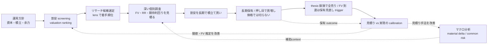

# Doctrine — Baibai-Loop の投資思想と大戦略

このリポジトリが **何を信じ、何を狙い、どの原則と語彙で判断するか** を定める正本。構造（3 層・7 package・CLI/SQLite 契約）は [`architecture.md`](./architecture.md)、資本とポジションの管理は [`portfolio-management.md`](./portfolio-management.md)、各工程の手順は [`workflow/`](./workflow/) を参照する。

運用モデルは **AI 主導・人間裁定**：AI がマクロ経済を分析してトレンドを読み、市場で過小評価されているお買い得銘柄を機械抽出し、長期積立・配当還元を前提とした長期保有に耐える銘柄を個別にリサーチして売買提案まで作る。人間はその提案を判断し、発注する。Baibai-Loop はこの分業に一貫性を持たせ、判断を後から検証できるようにするための基盤であり、投資助言サービスではない。

## 1. 目的（このシステムで達成したいこと）

日々の暮らしの中で **お買い得な優良銘柄を探し、長期で積み立てる**（配当利回りがあればなお良い）。狙いの核心は「一時的に売られすぎた割安株を掴む」ことにあり、想定どおりに上がらなくても **塩漬けを許容できる銘柄だけを選ぶ**。

売却の主因は **事業のファンダメンタルズ毀損（thesis break）** である。**フェアバリュー到達は保有見直しの trigger であって自動の全売り命令ではない**：FV 到達時は thesis health（永久損失兆候・invalidation・証拠鮮度）と、税・費用を引いた代替機会の期待値を比べ、`hold / add / reduce / exit` を判断する。税引後で明確に勝る乗換先が無ければ、割高でも保有を続けてよい。**株価が下がったこと自体では売らない**（価格による損切りは置かない）。だからこそ、採用の時点で **塩漬け耐性**（ネットキャッシュまたは健全な財務・営業キャッシュフローの黒字・低い有利子負債・借換に耐える体力）を必須の関門にする（配当は加点材料であって必須条件ではない）。

お買い得を見つける手段は **マクロ経済分析 × 機械スクリーニング × 深い個別調査** の組み合わせで、そこから **リスクリワードと期待利回りを見積もる**。運用を通じて磨くべき中核の技能は、この **「本当に割安か」の見積りの精度** であり、長期の投資活動を続ける中で継続的に高めていく。

## 2. 運用モデル — 単一ループと見積りの改善

Baibai-Loop が回すのは 1 つの長期投資ループである。その中核技能（見積り）を実現結果と突き合わせて磨くフィードバックを、ループ自体に組み込む。

- **改善は重厚な別機構ではなく、運用に内蔵した calibration（見積りと実現の突き合わせ）で行う**。entry 時の見積り（リスクリワード・期待利回り・フェアバリュー）を実現結果（実際のリターン・利回り・valuation の収束・thesis の的中）と突き合わせ、外れた箇所（マクロの読みか、screening の閾値か、フェアバリュー推定か、耐性判定か）を一つずつ特定して見積り手法を改める。
- 突き合わせの母数は 2 系統ある。**(a) 自分の保有の実現結果**（件数は少ないが、一つひとつを長期に深く観測する。最終的な判断品質の正）と、**(b) 全銘柄の長期 horizon リプレイ計測**（過去の各時点で機械見積り・ランキングを再構成し、実現リターンと突き合わせる。見積り「手法」の較正用で、件数を桁で補う）。(b) の 3m/6m は regression alert、1y は leading evidence、production の実証的変更候補には 3y/5y の完全な evidence を必要とする（柱 5）。

## 3. ベースの考え方（5 つの柱）

各柱は **(a) 信念 / (b) 根拠 / (c) 却下した対立案** の形で記す。

### 柱 1: 事実と分析の分離

- **(a)** candidates内のobserved / derived / estimateと、人間/AIによるjudgment（macro context・decision packet）は責務を分ける。禁止表現と運用ルールは§6[事実と分析の分離](#fact-analysis-separation)を正本とする。
- **(b)** 事実と意見が混ざると、AI が過去の解釈を「事実」として再生産してしまう。ファイル単位で分けておけば「解釈ファイルを AI に見せない」という選択ができ、後知恵バイアスと責任の所在の混乱を防げる。
- **(c)** タグや front matter の `type` で同一ファイル内を区分けする案は、混入したときに見落としやすく機械チェックも利きにくい。ファイル単位の物理的な分離が最も安全。

### 柱 2: マクロはmaterial delta、AIは企業別value captureとして扱う

- **(a)** マクロ分析は、discount rate・需要・資金調達・共通tail risk・sizing cautionという外部経路が個別5年期待値を変えたときだけ記録する補助contextである。screening、採用、順位、投入額の決定者にはしない。contextがない、またはstaleでも候補抽出は継続し、未来情報だけをhard errorにする。
- **(b)** AIはsectorではなく企業別の構造変化lensである。enabler、infrastructure、complement、adopter、disruptedのどこに位置するかと、競争優位・価格決定力・必要capex・顧客交渉力を通じて株主価値を獲得できるかをdecision packetで判断する。AI需要が増えてもvalue captureがなければ採用根拠にしない。
- **(c)** 非AI企業も個別のE[r]と永久損失リスクで同じ土俵に置く。macro/AIの合成score、自動sizing、sector順位は作らない。

### 柱 3: 見積りを磨くフィードバック先行

- **(a)** 完成した設計を待たず、不完全でもまずループを 1 周してから改善する。改善の対象は **リスクリワードと期待利回りの見積り精度**であり、entry 時の見積りを実現結果と突き合わせ続け、見積り手法を一つずつ改める。
- **(b)** 実際にループを回してはじめて、見積りのどこが系統的に外れているのか（マクロの読みか、フェアバリュー推定か、耐性判定か）が見えてくる。材料がなければ改善の方向は定まらない。
- **(c)** 設計を固めきってから運用を始めると、運用開始時点で陳腐化している。短期 screen の成績を大量の銘柄で backtest して最適化する重い改善ループは、長期保有では前提そのものが不要（柱 5）。

### 柱 4: Markdown / YAML 駆動、schema を契約の正本に

- **(a)** 投資判断の record は、front matter の揃った Markdown / YAML を正本とする。データ提供元から再取得できる入力やキャッシュは SQLite に閉じ込める。**成果物の機械契約（形・必須項目・enum）は `records/_schemas/*.json` を contract-of-record とし**、doc は JSON に書けないもの（計算式・enum の意味・設計判断の理由・境界条件）だけを持つ。
- **(b)** 1 人での運用では、判断 record をデータベースで維持し続けるのは現実的でない。ファイルと git なら差分・変更履歴・由来の追跡が標準ツールで扱え、AI が下書きし人間が確認する協働も自然に成り立つ。schema を正本にすれば、doc へ項目定義を書き写す冗長さと、doc と実装のずれを消せる。
- **(c)** 判断 record の SQLite 化や外部ツール（Notion / Airtable）への移管は、移行コストが高くベンダーへの囲い込みを招く。JSON / YAML 単独では人間にとって読みにくい。

### 柱 5: 計測ファーストのデータ基盤

- **(a)** 主軸は、全上場銘柄の実データを保持する **データ層（L1）** と、決定論的なscreen・導出指標・モデル見積りからなる **分析層（L2）** であり、判断層（L3 = records）はその消費者にあたる（3層の詳細は[`architecture.md`](./architecture.md)）。L2出力は`observed / derived / estimate`を区別し、決定論的に生成されてもE[r]やFV anchorを事実とは呼ばない。人間/AIの解釈は`judgment`としてdecision packetへ置く。計測手段を持たない機械的機能は追加しない。計測の対象は **長期戦略が依存するもの**（見積り精度・実現利回り・valuation の収束）に限る。**長期 horizon（3 か月以上）の見積り較正リプレイ**（過去 asof の point-in-time 再構成 × 実現リターンの突き合わせ。estimate calibration）はこの正式な計測経路であり、**短期（3 か月未満）horizon の forward-backtest による screen 成績最適化は行わない**。較正リプレイには誠実性の規律を課す: 有意性・統計的優位を主張しない（cohort の窓は重複し独立でないため、効果量と cohort 勝率で判断する）／仮説と採否基準は検証前に事前登録し、時間分割（design/confirm）の両方で整合した変更だけ採用する（grid search をしない）／survivorship・coverage の欠けを計数で開示する／累積リターン・年率・シャープ等を実績（track record）として掲げない。
- **(b)** スコアは軸ごとの座標（業種相対・自己レンジ相対の percentile）であり、単一の合成点や売買指示には決して畳まない。**単位（%/年）・成分分解（reversion / carry）・前提（anchor・実現率・cap）を持つ機械見積り（E[r]・FV アンカー）は「単一の合成点」とはみなさない** — ただし (i) 出力に成分と前提を必ず併記する、(ii) 較正リプレイで予測と実現を突き合わせ続ける、(iii) 採否と投入額の判断は人間に残る、を必須条件とする。正直な軸別の事実 + 人間の判断という役割分担が、AI の強み（機械可読な事実の整理・統合）を活かしつつ、弱み（判断の責任を負えないこと）を遮断する。
- **(c)** 機械学習によるスコアリングは、サンプルが 3 桁に満たない 1 人運用では過剰適合が必然で、判断の帰責も壊れる。固定閾値と見積り calibration で改善は十分に回る。MCP / API server 化やリアルタイム化は、1 人・ローカル完結の運用では不要（YAGNI）。

## 4. 語彙と構成要素

主要な成果物は **役割を一語で表す** slug（英語識別子）を持ち、人間向けには日本語の概念名で呼ぶ。読み解く鍵は **engine（機械処理 = 動詞）と artifact（成果物 = 名詞）を区別する**こと。

| 日本語概念名 | slug | 種別 | 層 | 役割 |
| --- | --- | --- | --- | --- |
| 運用方針 | portfolio management | governance | — | 資本・許容リスク・ポジション管理・kill switch |
| マクロ環境分析 | macro context | 分析（判断） | L3 | 個別期待値を変えるmaterial deltaと共通riskの補助context |
| 市場データ基盤 | market.sqlite | データ store | L1 | 全上場銘柄の実データの正本 |
| 機械スクリーニング | screening | 機械処理 | L2 | valuation ranking で割安ゾーンを機械抽出 |
| 通過銘柄リスト | candidates | 機械成果物 | L2 出力 | observed / derived / estimateを分離したsnapshot |
| リサーチ候補選定 | select | 機械処理 | L2 | 通過銘柄に機械 E[r] 降順の着手順位と lens 注記を付ける |
| 個別銘柄リサーチ | thesis | 分析（判断） | L3 | FV・RR・期待利回り・耐性・採否を判断する投資メモ |
| 戦略プレイブック | `playbook_id` | L2 設定 + research checklist | 割安型の label・閾値・除外条件を `screening-rules` から候補へ注記し、個別調査の確認項目を保持する |
| 売買提案 | trade proposal | 判断の入口 | L3 | 銘柄・価格・株数を人間に上げる（GitHub Issue） |
| 売買執行記録 | position | 執行 | L3 | 注文・約定・保有・全売り決済・見積り calibration |

`research`（個別銘柄を調べる活動）と `thesis`（その成果物 = 投資メモ）は別の語彙。ディレクトリや component の識別子には成果物側の slug `thesis` を使う。

### Evidence Taxonomy

thesis で見積りの根拠を検証するときの分析レンズ / リターン源泉の分類（統計的なリスクファクターの体系ではない）。candidates と投資メモの evidence hit では `fundamental`・`valuation`・`market-derived`・`positioning/liquidity`・`catalyst` に限定する。`macroeconomic`・`policy/geopolitical` は macro context 側で扱う。schema の enum には `market_derived` / `positioning_liquidity` のような ASCII 安全な値を使う。`technical` は正準の分類ではない（価格・相対強度・出来高は `market-derived`、信用残・売買代金・規制銘柄指定は `positioning / liquidity` に割り当てる）。

## 5. 責務境界

- **運用方針 (portfolio management)**：目的・制約・資本・許容リスク・ポジション管理・投資対象の範囲・thesis health と税引後代替で保有を見直す規律を扱う。個別銘柄の thesis や entry / exit の個別設計は扱わない。
- **マクロ環境分析 (macro context)**：外部記事と指標データを参照し、個別期待値へ影響するmaterial deltaと共通riskを短く残す。記事本文や取得ログは保存しない。
- **通過銘柄リスト (candidates)**：screenの機械出力。observed、derived、estimateを由来付きで残し、judgment・因果解釈・相場観を書かない。
- **個別銘柄リサーチ (thesis)**：投資メモ。フェアバリュー・想定上昇率と下落率・リスクリワード・期待利回り・塩漬け耐性・毀損条件（invalidation）を検証する。
- **売買提案 (trade proposal)**：research の採用結論を「どの銘柄を・いくらで・何株」という具体提案に落とし、GitHub Issue で人間に上げる入口。
- **売買執行記録 (position)**：実際に発注・entry した判断の注文・約定・保有・全売り決済と、見積り vs 実現の calibration を記録する。

## 6. 事実と分析の分離（禁止表現）

candidatesのobserved / derived / estimateと、macro context・decision packetのjudgmentは物理的・構造的に分ける。candidatesにAI judgment・因果解釈・相場観を書かず、estimateをobserved factと呼ばない。**この節はAP-05が根拠として引く正本**であり、アンカー`#fact-analysis-separation`を変更しない。

事実層で禁止する表現：

- 因果の推論・理由付け：「〜を示唆する」「〜を受けて」「〜を背景に」「〜が顕在化」「観測される」
- 予測：「次の FOMC では〜が予想される」
- 意味付け：「この動きは〜を意味する」「正当化材料」「early evidence hit」「構造要因」
- 重要度の評価：「注目すべき」「重要な」「焦点となる」（Major / Notable は変化量の統計的な大きさを表すラベルであり、重要度の評価ではない）

事実層で使う用語は、解釈を招かない中立的な語を選ぶ（「連続トレンド」「転換点」ではなく「方向履歴」「方向反転」）。新しい用語を導入するときは「自然言語として解釈や予測を含意しないか」を確認する。解釈・因果・予測は macro context / thesis の分析層に置く。

## 7. 分析階層：世界情勢 → 地域経済 → 個別資産

マクロ分析は上流から順に読む：**世界情勢**（グローバルマクロ・主要中央銀行・コモディティ・地政学）→ **地域経済**（日本の一次統計・金融政策・為替）→ **個別資産**（マーケット指標・セクター動向・個別イベント）。因果が「グローバル → 地域 → 個別」の順に伝播することに忠実な構成にする（例: FOMC → ドル円 → 輸出関連株）。上位層で扱った指標（米 10 年金利・為替など）を下位層で繰り返さない。

## 8. 非目標

非目標は思想的なタブーではなく、**現在の戦略（長期積立・1 人運用）が計測経路を持てない、または必要としない機能の線引き**である。戦略の前提が変わったら、柱 5 の計測経路を用意した上で見直してよい。

- 過去データに対する閾値の網羅探索（grid search）やパラメータ最適化、戦略の累積リターン（年率・最大ドローダウン・シャープレシオ）を実績として掲げること（誠実性の規律。柱 5）。
- 機械学習によるスコアリング・予測。スコアは軸別の座標として出し、合成点に畳まない（成分と前提を持つ機械見積り E[r] / FV アンカーは柱 5 (b) の条件下で範囲内）。
- 自動発注・リアルタイム処理。発注を人間の裁定に置くのは帰責の分業のためであり、**判断材料の生成・分析・提案の作成を AI が主導することは範囲内**。
- 銘柄全体を対象にした**短期（3 か月未満）horizon** の forward-backtest による screen 成績最適化（長期 horizon の見積り較正リプレイは柱 5 の正式な計測経路であり、非目標ではない）。
- ETF / 投資信託 / 海外株、口座・税制のモデル化。
- 汎用のデータ配信基盤（feature store）・MCP / API server 化。SQLite は market data のローカル正本とし、AI は CLI と SQL で直接読む。

## 9. 参考

- [`architecture.md`](./architecture.md)：3 層インフラ・7 package・CLI / SQLite 安定契約・repository map
- [`portfolio-management.md`](./portfolio-management.md)：資本・ポジション管理・cap・積立・余力・kill switch 仕様
- [`workflow/`](./workflow/)：単一ループ各工程の手順（macro / screening / research / position / playbooks）
- [`anti-patterns.md`](./anti-patterns.md)：失敗パターンと commit 前チェックリスト
