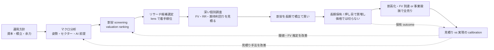

# Doctrine — Baibai-Loop の投資思想と大戦略

このリポジトリが **何を信じ、何を狙い、どの原則と語彙で判断するか** の正本。構造（3 層・7 package・CLI/SQLite 契約）は [`architecture.md`](./architecture.md)、資本・ポジション管理は [`portfolio-management.md`](./portfolio-management.md)、各工程の手順は [`workflow/`](./workflow/) を参照する。

Baibai-Loop は自己運用の裁量判断を一貫させ後から検証するための基盤であり、投資助言サービス・委任運用システムではない。

## 1. 目的（ビジネス価値）

暮らしの中で **お買い得な優良銘柄を探し、長期で積み立てる**（配当利回りがあれば尚よい）。核心は「一時的に過剰に売られた割安を掴む」ことだが、出口は **期間ではなく valuation（割高化）で判断して全売り**し、想定通り上がらなくても **塩漬けを許容できる銘柄だけを選ぶ**。売りは **(a) 割高化（FV 到達・割高ゾーン）** か **(b) 事業の fundamental 毀損** の 2 つだけをトリガーにし、**価格の逆行では切らない（price-stop 撤廃）**。だからこそ採用時に **塩漬け耐性**（net-cash・営業 CF 黒字・低負債・借換耐性）を必須ゲートにする（配当は加点材料であり必須ではない）。

お買い得の発見手段は **マクロ経済分析 × 機械スクリーニング × 深い個別調査** で、そこから **リスクリワードと期待利回りを見積もる**。運用が磨くべき中核スキルは **この「割安か」の見積りの精度**であり、長期の投資活動を続ける中で継続的に磨く。

## 2. 運用モデル — 単一ループと見積り改善

Baibai-Loop は 1 つの長期投資ループであり、その中核スキル（見積り）を実現結果との突き合わせで磨くフィードバックを内蔵する。

- **改善は重い別機構ではなく運用の中の calibration**。entry 時の見積り（RR・期待利回り・fair value）を、実現結果（realized return / yield・valuation の収束・thesis の的中）と突き合わせ、見積り手法（macro の読み・screening 閾値・FV 推定・耐性判定）を離散的に改善する。
- 母数は自分の保有の実現結果で、n は小さい。だが各 holding を長期に深く観測する。フィードバックが遅く n が小さいのは long-hold 戦略の性質上の必然として受容する（短期 universe backtest による大 N 最適化はしない、柱 5）。

## 3. ベースの考え方（5 つの柱）

各柱は **(a) 信念 / (b) 根拠 / (c) 却下した対立案** で記す。

### 柱 1: 事実と分析の分離

- **(a)** 記録すべき **事実**（candidates）と、人間 / AI の **解釈**（macro context・thesis）は責務を分けて別ファイルで管理する。禁止表現と運用ルールは §6 [事実と分析の分離](#fact-analysis-separation) を正本とする。
- **(b)** 事実と意見が混在すると、AI が過去の解釈を「事実」として再生産する。ファイル単位で分離すれば「解釈ファイルを AI に見せない」選択ができ、後知恵バイアスと帰責の混乱を防げる。
- **(c)** タグや front matter の `type` で同一ファイル内を分ける案は、混入時に漏れやすく機械チェックしにくい。ファイル単位の物理分離が最も安全。

### 柱 2: Macro が姿勢を決める

- **(a)** マクロ分析は screening の前提であるだけでなく、**リスク姿勢とセクター選択のドライバー**である。リスクを取るべきでない局面は **ディフェンシブ**、取るべき局面は **その追い風セクター**へ配分する。**AI は中心セクター**であり、AI による産業革命を前提に長期の産業成長とマクロを組み立てる。ただし hard gate 化はせず、姿勢と優先度を与える。
- **(b)** 逆風業種の割安は構造的 trap になりやすく、「過剰に売られた」の判定にはマクロ姿勢の確認が要る。世界情勢 → 日本経済 → 日本株の伝播（§7）に沿って top-down で読むと、固有要因と外部要因を切り分けられる。AI 期待は単独の採用根拠・sizing 根拠にはしない。
- **(c)** マクロを prose の注意喚起だけにすると逆風下の割安を拾う危険が残る。マクロだけで候補を決めると個別の valuation・耐性・catalyst を活かせない。マクロは numeric driver（自動 sizing 倍率）にはしない。

### 柱 3: 見積りを磨くフィードバック先行

- **(a)** 完成設計を待たず、不完全でもループを 1 周してから改善する。改善の対象は **リスクリワードと期待利回りの見積り精度**であり、entry の見積りを実現結果と継続的に突き合わせ、見積り手法を離散的に磨く。
- **(b)** 実際にループを回すと、見積りのどこが systematically 外れるか（macro 読みか、FV 推定か、耐性判定か）が見える。材料がないと改善の方向が定まらない。
- **(c)** 設計を凍結してから運用開始すると陳腐化する。短期 screen の forward-alpha を大 N backtest で最適化する重い改善ループは、長期保有では前提ごと不要（柱 5）。

### 柱 4: Markdown / YAML 駆動、schema を契約の正本に

- **(a)** 投資判断 record は front matter が揃った Markdown / YAML を正本にする。provider 由来の再生成可能な input / cache は SQLite に閉じる。**成果物の機械契約（形・必須・enum）は `records/_schemas/*.json` を contract-of-record とし**、doc は JSON に書けないもの（式・enum の意味・WHY・境界）だけを持つ。
- **(b)** 1 人運用では判断 record の DB 運用は維持しきれない。ファイル + git で diff / blame / history が標準ツールで扱え、AI 下書き + 人間確認の協働が自然。schema を正本にすると doc の field 再転記の冗長と drift を消せる。
- **(c)** 投資判断 record の SQLite 化・外部ツール（Notion / Airtable）は移行困難で vendor lock-in。JSON / YAML 単独は readability が低い。

### 柱 5: 計測ファーストのデータ基盤

- **(a)** 主軸は全上場銘柄の実データを保持する **データ層(L1)** と、決定論的な screen / 軸別スコアからなる **分析層(L2)** で、判断層(L3 = records) はその消費者（3 層の詳細は [`architecture.md`](./architecture.md)）。ここでの L2 の「分析」は決定論的な機械処理を指し、その出力（candidates・軸別スコア）は柱 1 の意味では **事実** に属する（柱 1 / §6 で「分析」と呼ぶのは人間 / AI の解釈＝macro context・thesis）。計測経路のない機械的機能は追加しない。計測対象は **長期戦略が依存するもの**（見積り精度・realized yield・valuation 収束）とし、**短期 universe forward-backtest（replay / cohorts / ablation）は行わない**。
- **(b)** スコアは軸別の座標（sector 相対・自己レンジ相対の percentile）であり、単一の合成点や売買指示には決して畳まない。正直な軸別事実 + 人間の判断という界面が、AI の強み（機械可読な事実の合成）を活かし弱み（帰責不能）を遮断する。
- **(c)** 機械学習によるスコアリングは、サンプルが 3 桁に満たない 1 人運用では overfit が必然で帰責性も壊れる。固定閾値 + 見積り calibration で十分に改善が回る。MCP / API server 化・リアルタイム化は single-operator・local-first で YAGNI。

## 4. 語彙と構成要素

主要 artifact は **役割を一語で表す** slug（英語識別子）を持ち、人間向けには日本語概念名で呼ぶ。読み解く鍵は **engine（機械処理＝動詞）と artifact（成果物＝名詞）を区別する**こと。

| 日本語概念名 | slug | 種別 | 層 | 役割 |
| --- | --- | --- | --- | --- |
| 運用方針 | portfolio management | governance | — | 資本・許容リスク・ポジション管理・kill switch |
| マクロ環境分析 | macro context | 分析（判断） | L3 | 姿勢・セクター・AI 前提を読む環境読み |
| 市場データ基盤 | market.sqlite | データ store | L1 | 全上場銘柄の実データの正本 |
| 機械スクリーニング | screening | 機械処理 | L2 | valuation ranking で割安ゾーンを機械抽出 |
| 通過銘柄リスト | candidates | 成果物（事実） | L2 出力 | スクリーニング通過銘柄の事実 snapshot |
| リサーチ候補選定 | select | 機械処理 | L2 | 通過銘柄を lens で絞り着手順位を付ける |
| 個別銘柄リサーチ | thesis | 分析（判断） | L3 | FV・RR・期待利回り・耐性・採否を判断する投資メモ |
| 戦略プレイブック | playbooks | governance | — | 再現可能な割安 value の型（archetype） |
| 売買提案 | trade proposal | 判断の入口 | L3 | 銘柄 / 価格 / 株数を人間に上げる（GitHub Issue） |
| 売買執行記録 | position | 執行 | L3 | 注文・約定・保有・全売り決済・見積り calibration |

`research`（個別銘柄を調べる活動）と `thesis`（その成果物 = 投資メモ）は別語彙。ディレクトリ・component の識別子には artifact 側の slug `thesis` を使う。

### Evidence Taxonomy

thesis で見積りを検証する analytical lens / return driver の taxonomy（systematic risk factor ではない）。candidate-level / 投資メモの evidence hit では `fundamental`・`valuation`・`market-derived`・`positioning/liquidity`・`catalyst` に限定する。`macroeconomic`・`policy/geopolitical` は macro context 側で扱う。schema enum では `market_derived` / `positioning_liquidity` のような ASCII-safe 値を使う。`technical` は正準ではない（価格・相対強度・出来高は `market-derived`、信用残・ADV・規制銘柄は `positioning / liquidity`）。

## 5. 責務境界

- **運用方針 (portfolio management)**：目的・制約・資本・許容リスク・ポジション管理・eligible universe・kill switch・割高で全売りの原則を扱う。個別 thesis や entry / exit は扱わない。
- **マクロ環境分析 (macro context)**：外部記事と指標 series を参照し、screening 前の姿勢・セクター・AI 前提を読む。記事本文や監査ログは保存しない。
- **通過銘柄リスト (candidates)**：screen fact layer。ticker-level の事実を残し、解釈・予測・相場観を書かない。
- **個別銘柄リサーチ (thesis)**：投資メモ。FV・expected upside/downside・risk/reward・期待利回り・塩漬け耐性・invalidation を検証する。
- **売買提案 (trade proposal)**：research の採用結論を「どの銘柄を・いくらで・何株」の具体提案に落とし GitHub Issue で人間に上げる入口。
- **売買執行記録 (position)**：実際に order / entry した採用判断の注文・約定・保有・全売り決済と、見積り vs 実現の calibration を記録する。

## 6. 事実と分析の分離（禁止表現）

事実層（candidates）と分析層（macro context・thesis）を物理的に別ファイル / 別ディレクトリに分ける。事実層に解釈・因果・予測を書かない。**この節は AP-05 が根拠に引く正本**であり、アンカー `#fact-analysis-separation` を切らない。

事実層で禁止する表現：

- 因果推論・観測付け：「〜を示唆する」「〜を受けて」「〜を背景に」「〜が顕在化」「観測される」
- 予測：「次の FOMC では〜が予想される」
- 意味付け：「この動きは〜を意味する」「正当化材料」「early evidence hit」「構造要因」
- 重要度評価：「注目すべき」「重要な」「焦点となる」（Major / Notable は変化量の統計的大きさのラベルであり重要度評価ではない）

事実層で使う用語は解釈を招かない中立語を選ぶ（「連続トレンド」「転換点」でなく「方向履歴」「方向反転」）。新用語導入時は「自然言語として解釈や予測を含意しないか」を確認する。解釈・因果・予測は macro context / thesis の分析層に置く。

## 7. 分析階層：世界情勢 → 地域経済 → 個別資産

マクロ分析は上から順に：**世界情勢**（グローバルマクロ・主要中銀・コモディティ・地政学）→ **地域経済**（日本の一次統計・金融政策・為替）→ **個別資産**（マーケット指標・セクター動向・個別イベント）。因果の伝播が「グローバル → 地域 → 個別」の順であることに忠実にする（例: FOMC → USD/JPY → 輸出関連）。上位層で扱った指標（米 10Y・為替）を下位層で再掲しない。

## 8. 非目標

- 過去データへの閾値 grid search / パラメータ最適化、戦略累積リターンの track-record claim。
- 機械学習によるスコアリング・予測。スコアは軸別座標として出し、合成点に畳まない。
- 自動発注・リアルタイム処理。
- 短期 universe forward-backtest（replay / cohorts / ablation）による screen 最適化。
- 部分売却 / リバランスの schema 化（割高は全売り）、ETF / 投信 / 海外株、口座・税制のモデル化。
- 汎用 feature store / MCP / API server。SQLite は market data の local canonical store とし、AI は CLI と SQL で直接読む。

## 9. 参考

- [`architecture.md`](./architecture.md)：3 層インフラ・7 package・CLI / SQLite 安定契約・repository map
- [`portfolio-management.md`](./portfolio-management.md)：資本・ポジション管理・cap・積立・余力・kill switch 仕様
- [`workflow/`](./workflow/)：単一ループ各工程の手順（macro / screening / research / position / playbooks）
- [`anti-patterns.md`](./anti-patterns.md)：失敗パターンと commit 前チェックリスト
