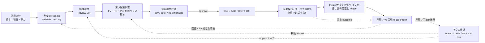

# Doctrine — Baibai Loop の投資思想と大戦略

この文書は、Baibai Loopが何を狙い、どの原則と語彙で判断するかを定める。3層構造、package、CLI、SQLiteの契約は[`architecture.md`](./architecture.md)、資本とpositionの規律は[`portfolio-management.md`](./portfolio-management.md)、操作手順は[各skill](../.agents/skills/)が所有する。

## 1. 目的と人間境界

Baibai Loopは、永久的な資本毀損を抑えながら、一時的に売られすぎた優良銘柄を見つけ、長期で積み立てるための基盤である。予算消化や注文数ではなく、その時点で最も割安な候補を人間が納得して判断できることを最上位成果とする。候補は、永久損失、5年期待総合return/FV乖離、portfolioへの追加価値、購入可能性の順で比較する。資金目安、既存保有、予約は判断材料だが、価値順位を先に変えない。

お買い得を見つける手段は、マクロ経済分析、機械screening、深い個別researchである。各候補のrisk/rewardと期待利回りを見積もり、「本当に割安か」という中核技能を長期の実現結果で磨く。配当は加点材料であり、必須条件ではない。

購入時は、想定どおりに上がらなくても長期保有できる耐性を必須の関門とする。合格条件は、ネットキャッシュ、または健全な財務に加えて、営業cash flowの黒字、低い有利子負債、借換に耐える体力を持つことである。売却の主因は事業のファンダメンタルズ毀損（thesis break）であり、株価下落だけでは売らない。FV到達は自動売却ではなく保有見直しのtriggerである。具体的な`hold / add / reduce / exit`の規律は[`portfolio-management.md`](./portfolio-management.md#holding-discipline)が所有する。

運用は **AI主導・人間裁定** とする。AIは観測・分析・提案を担い、人間は`approve / defer / reject`とbroker操作を担う。リポジトリが保持するbroker factは、人間が確認して報告したものに限る。AIは未報告の注文状態を補間せず、broker会計を完全再現しない。候補なし、購入見送り、価格超過による`defer`はいずれも正常な判断である。Baibai Loopは投資助言サービスではない。

## 2. 運用モデル — 単一ループと見積りの改善

Baibai Loop が回すのは 1 つの長期投資ループである。その中核技能（見積り）を実現結果と突き合わせて磨くフィードバックを、ループ自体に組み込む。



- **改善は重厚な別機構ではなく、運用に内蔵した calibration（見積りと実現の突き合わせ）で行う**。entry 時の見積り（リスクリワード・期待利回り・フェアバリュー）を実現結果（実際のリターン・利回り・valuation の収束・thesis の的中）と突き合わせ、外れた箇所（マクロの読みか、screening の閾値か、フェアバリュー推定か、耐性判定か）を一つずつ特定して見積り手法を改める。
- 突き合わせの母数は 2 系統ある。**(a) 自分の保有の実現結果**（件数は少ないが、一つひとつを長期に深く観測する。最終的な判断品質の正）と、**(b) 全銘柄の長期 horizon リプレイ計測**（過去の各時点で機械見積り・ランキングを再構成し、実現リターンと突き合わせる。見積り「手法」の較正用で、件数を桁で補う）。(b) の 3m/6m は regression alert、1y は leading evidence、production の実証的変更候補には 3y/5y の完全な evidence を必要とする（柱 5）。

<a id="improvement-value-hierarchy"></a>

### 改善提案の価値階層

基盤改善の提案と review 指摘は、次の直接的な成果により **T1 > T2 > T3 ≫ T4** の順で優先する。この階層は改善へ資源を配分する基準であり、銘柄比較における永久損失の関門や、一次情報確認・機械検算など現在の判断を正しくするための必須検証を弱めない。

| tier | 直接的な成果 | 採否の原則 |
| --- | --- | --- |
| **T1** | お買い得銘柄を拾える確率・精度を上げる。候補発見、FV / E[r] の見積り、個別 research の質を改善する | 最優先。実際の候補抽出または投資判断へ至る因果経路と、効果を確かめる計測を示す |
| **T2** | 誤った買いによる永久的な資本毀損を防ぐ。事業・財務・valuation の誤認や計算誤りを判断前に検出する | T1 に次いで優先。どの誤判断をどの検証で止めるかを示す |
| **T3** | 反復する運用の時間・費用・手戻りを減らす | T1 / T2 の作業量または判断までの時間を実際に減らせる場合に採用する |
| **T4** | 監査、再現性、復元、provenance、lineage のみを改善する | **デフォルト非採用**。人間の実損が確認された場合、または T1〜T3 への具体的で検証可能な寄与を示せる場合だけ検討する |

提案者と reviewer は、各提案・指摘の冒頭に `価値tier: Tn — <直接的な成果への因果経路>` を 1 行で宣言する。primary tier は、その提案の完了条件で直接確認する成果から 1 つ選び、副次効果で優先度を上げない。異なる tier の直接成果がそれぞれ独立した完了条件を持つ場合は提案を分ける。抽象的な「安全性」「品質」「将来役立つ」だけで T4 を上位へ読み替えない。

validation や hash のように監査にも使える手段でも、現在の候補・見積り・購入判断の誤りをその場で防ぐなら T1 または T2 である。失敗しても候補、順位、FV / E[r]、購入判断、canonical portfolio state、calibration のいずれも変えず、成果が後日の説明・追跡・復元だけに限定される場合は T4 とする。

実取引の order / fill、ledger correction、法務・規制・税務で必要な記録はこの改善優先度による削除対象ではない。T1 の改善であっても T2 の必須関門を弱める案は採用しない。

<a id="development-investment-policy"></a>

### 開発投資の大方針

改善・新機能・review 指摘へ開発資源を配分するときの判断順序。**何を達成したいか**は §1、**どの成果を優先するか**は前節の価値階層が定め、本節は **実装規模と複雑性をどう扱うか** を定める。

1. **ビジネス価値の最大化を最優先にする。** 直接の成果は前節の価値階層（T1 > T2 > T3 ≫ T4）で測る。
2. **保守性を次点に置く。** 複雑性として数えるのは概念数・結合・運用手順・維持負担であり、レビュー不能な形で持ち込まれる変更もこの負担に含める。規模はレビュー可能な単位へ分割して扱い、規模自体を棄却理由にしない。
3. **実装量と工数の大きさを棄却理由にしない。** 実装は AI が担うため、規模そのものは制約ではない。アーキテクチャが妥当でクリーンなら、実装量が大きく難しい選択肢を選んでよい。この自由は検証とレビューの省略を含まないが、検証・防御も前節の価値階層で測る — 現在の判断の誤りをその場で防ぐ T1 / T2 の検証は規模に関わらず置き、監査・再現・将来の安全のためだけの T4 の防御は置かない。
4. **同じ機能範囲を実現する 2 案では、クリーンで大きい設計を狭くて複雑な仕様より優先する。** 狭い surface へ押し込めて概念や責務境界を歪めるより、境界の通った大きい設計を選ぶ。将来の拡張性と保守性はここから生まれる。機能範囲そのものを広げる根拠にはしない — 最小で可逆な surface の選好は変わらない。
5. **実現経路を示せない提案の優先度を下げる。** 計測経路（柱 5）と、実際に読む人・使う工程を示せない機能は、規模の大小に関わらず採らない。

2 と 3 は対立しない。複雑性の評価が測るのは持ち込まれる概念・結合・運用負担であり、実装工数はその指標ではない。

## 3. ベースの考え方（5 つの柱）

各柱は **(a) 信念 / (b) 根拠 / (c) 却下した対立案** の形で記す。

### 柱 1: 事実と分析の分離

- **(a)** candidates内のobserved / derived / estimateと、人間/AIによるjudgment（macro context・thesis）は責務を分ける。禁止表現と運用ルールは§6[事実と分析の分離](#fact-analysis-separation)を正本とする。
- **(b)** 事実と意見が混ざると、AI が過去の解釈を「事実」として再生産してしまう。store・table単位で分けておけば「judgmentを AI に見せない」という選択ができ、後知恵バイアスと責任の所在の混乱を防げる。
- **(c)** 同一tableに`type`列やflagでjudgmentを混在させる案は、混入したときに見落としやすく機械チェックも利きにくい。store・table単位の物理的な分離が最も安全。

### 柱 2: マクロは機械読み値 + material delta、構造変化は企業価値への影響として扱う

- **(a)** マクロは次の2層に分ける。
  - **macro reading（L2）**：登録全系列の水準、方向、percentile、閾値注記、観測の齢を毎営業日に機械計算する。regime分類、合成score、売買signalは出さない。
  - **macro context（L3）**：人間が判断するときだけ書く。環境評価（core）、経路横断の支配的な力と相互作用（synthesis）、日本株積立ループへの接続（connection）を分け、coreとsynthesisはuse-case agnosticにする。synthesisとconnectionが引用できるseriesは、依拠するcore sectionが引用済みのものに限り、そのsectionを`core_section_ids`で名指しする。この参照方向は機械契約で強制し、coreを単独で自己完結させる。coreは攻め／守りのどちらの環境かを反証条件付きで判断し、sector tilt、research優先度、sizing cautionはconnectionだけに置く。field単位の契約は[`reference/macro.md`](./reference/macro.md#3-層構成core環境評価synthesis統合評価connection積立ループ接続)が所有する。

  どちらも機械screening、ranking、sizingへ混入させず、売買タイミング、現金比率、配分を指示しない。macro contextはresearchの着手順を決めるjudgment入力として使う。contextがない、または古くても候補抽出は続け、未来情報だけをhard errorにする。鮮度は書き手が賞味期限を宣言せず、読み手が`as_of`と自分の閾値で判断する。
- **(b)** AIを含む技術・産業構造変化は、その仮説を外すと3年/5年scenario、FVとrequired return、永久損失、最強反対仮説、またはCapital Allocation Assessmentが変わる場合だけmaterialとする。正の影響は一次情報と必要な独立裏取りからscenario assumption、FV、比較理由へ、負の影響は`structural_decline`、最強反対仮説、必要ならscenarioとFVへ接続する。「AIを使っている」「市場が成長する」という事実だけでbase scenarioや倍率を上げない。
- **(c)** materialでない構造変化には言及・専用source・専用reviewを要求しない。AI theme、role、専用scoreでscreening、順位、sizingを変えず、企業ごとのE[r]と永久損失リスクを同じ土俵で比較する。

### 柱 3: 見積りを磨くフィードバック先行

- **(a)** 完成した設計を待たず、不完全でもまずループを 1 周してから改善する。改善の対象は **リスクリワードと期待利回りの見積り精度**であり、entry 時の見積りを実現結果と突き合わせ続け、見積り手法を一つずつ改める。
- **(b)** 実際にループを回してはじめて、見積りのどこが系統的に外れているのか（マクロの読みか、フェアバリュー推定か、耐性判定か）が見えてくる。材料がなければ改善の方向は定まらない。
- **(c)** 設計を固めきってから運用を始めると、運用開始時点で陳腐化している。短期 screen の成績を大量の銘柄で backtest して最適化する重い改善ループは、長期保有では前提そのものが不要（柱 5）。

### 柱 4: application DB 正本、Git は method / config

- **(a)** task、macro context、research_triage、research、Capital Allocation Assessment、portfolio ledger / outcome、operation session という application data は application DB を正本とする。再生成可能な screening run は専用 run store、market / macro series は各 L1 store に分離する。method、設定、playbook、コード、docs は Git に置く。機械契約は DB constraint、engine 内の model、application service の write-time validation が担う。
- **(b)** 書き込みは AI との会話を入口に `baibai-engine` CLI が行う。`baibai-web` は application DB と各 read store を読むだけの UI で、閲覧専用 read model への publish も同じ読み取り側にあり、正本を書き換えない。この分業により、同じ判断や運用状態の第二の正本を作らず、CLI と UI の意味を揃えられる。
- **(c)** GitHub Issue や Markdown / YAML を application data の正本にはしない。GitHub は開発作業に使い、運用 workspace は `operation_session`、確定した entity は各 DB table に置く。外部 SaaS を正本にすると local-first の運用と application service の境界が崩れるため採用しない。

### 柱 5: 計測ファーストのデータ基盤

- **(a)** 全上場銘柄の実データを持つデータ層（L1）と、決定論的なscreen・導出指標・モデル見積りを作る分析層（L2）を主軸にする。application DBの判断層（L3）はその消費者である。3層の詳細は[`architecture.md`](./architecture.md)が所有する。L2は`observed / derived / estimate`を区別し、決定論で生成してもE[r]やFV anchorを事実と呼ばない。人間とAIの解釈は`judgment`としてthesisへ置く。

  機械的機能には計測手段を持たせ、計測対象は見積り精度、実現利回り、valuationの収束など長期戦略が依存するものに限る。正式な計測経路は、3か月以上の長期horizonで行うestimate calibrationである。過去`as_of`のpoint-in-time状態を再構成し、見積りと実現returnを突き合わせる。3か月未満のforward-backtestによるscreen成績の最適化は行わない。

  較正リプレイでは、有意性や統計的優位を主張せず、効果量とcohort勝率で判断する。cohortの窓が重複し、独立ではないためである。仮説と採否基準は検証前に登録し、時間分割したdesignとconfirmの両方で整合する変更だけを採用する。grid searchは行わない。survivorshipとcoverageの欠けは計数で開示し、累積return、年率、シャープなどをtrack recordとして掲げない。
- **(b)** スコアは軸ごとの座標（業種相対・自己レンジ相対の percentile）であり、単一の合成点や売買指示には決して畳まない。**単位（%/年）・成分分解（reversion / carry）・前提（anchor・実現率・cap）を持つ機械見積り（E[r]・FV アンカー）は「単一の合成点」とはみなさない** — ただし (i) 出力に成分と前提を必ず併記する、(ii) 較正リプレイで予測と実現を突き合わせ続ける、(iii) 採否と投入額の判断は人間に残る、を必須条件とする。正直な軸別の事実 + 人間の判断という役割分担が、AI の強み（機械可読な事実の整理・統合）を活かしつつ、弱み（判断の責任を負えないこと）を遮断する。
- **(c)** 機械学習によるスコアリングは、サンプルが 3 桁に満たない 1 人運用では過剰適合が必然で、判断の帰責も壊れる。固定閾値と見積り calibration で改善は十分に回る。外部向けの汎用データ配信（feature store）・MCP server・書き込み API の公開も、1 人・ローカル完結の運用では不要（YAGNI）。

<a id="vocabulary"></a>

## 4. 語彙と構成要素

domain 語彙はこの節を正本とする。新しい domain 語は、まず命名文法に照らしてこの節へ行を追加してから使う（文法にない語を schema・CLI・UI・docs へ直接持ち込まない）。退役語のblacklistは保持せず、変更時にactive surfaceを横断確認する。

### 命名文法

1. **パイプライン状態**は銘柄集合を表す普通名詞で命名する（candidates, Review Set, research_triage, position, outcome）
2. **判断文書**は内容・役割で命名し、形式（packet / record / report）で命名しない（macro context, thesis, thesis review, Position Review）
3. **機械成果物**は工程 + 出力で命名し、judgment と呼ばない（screening run, Security Analysis, Review Set）
4. **活動・工程名**（screening, research, macro analysis）は workflow doc と CLI domain・package 名に使い、artifact 名には使わない
5. **表示物（projection）**は canonical ではない（Baibai Loop の画面、cloud serving の view JSON）
6. **UI タブは分析対象**で命名する（Macro = 市場環境の top-down 分析対象、Stocks = 個別銘柄の bottom-up 分析対象）
7. **プロダクト名とプログラム識別子を混ぜない**。人間に見せる呼称は `Baibai Loop` の 1 語だけで別名を作らず、package・CLI とその責務を説明する文は識別子（`baibai_engine` / `baibai-engine` / `baibai_web` / `baibai-web`）を主語にする

### パイプライン状態機械

資本は銘柄集合の状態遷移として一直線に流れる。gate の主体は資本（不可逆性）に近づくほど機械 → AI+人間 → 人間へ移る。機械は広さを処理し、人間が不可逆を所有する。

| 状態遷移 | gate 主体 | 判断文書（L3） | 機械成果物（L2） |
| --- | --- | --- | --- |
| universe → Security Analyses | 機械（screening） | — | screening run |
| Security Analyses → Review Set | 4 Valuation Approaches + composer | — | Nominations + Review Set |
| Review Set → Research Triage | AI | Research Triage（`research / skip`と理由） | — |
| Research Triage → Research Set | 人間（admission） | operationのhuman confirmation | — |
| Research Set → allocate / no allocation / defer | AI research → 独立レビュー → 人間 | thesis + thesis review + Capital Allocation Assessment | evaluate 派生値 |
| allocate → position | 人間（broker 執行 → 報告） | ledger events | — |
| position → hold / add / reduce / exit | AI draft + 人間確認 | Position Review（thesis health 判定） | — |
| position → outcome | 機械計測 + 年次評価 | outcome | calibration replay |

`macro reading` と `macro context` はどの遷移にも属さない ambient 入力であり、reading は macro context 執筆の必須入力、macro context は Research Triage と thesis 執筆の判断材料になる（screening は macro-blind のまま）。Research Triage・ledger は「状態」と「その canonical record」が同一物であり、thesis・Position Review は状態ではなく遷移の理由書である。

### Candidate Discovery の概念と authority

```text
Observed Fact ──────────────┐
                            ├─→ Derived Metric
Observed Fact + Metric ─────┴─→ Model ─→ Estimate
Observed Fact + Metric ───────→ Security Analysis
Security Analysis ────────────→ 4 Valuation Approaches ─→ Nominations
Nominations ──────────────────→ overlap-first composer ─→ Review Set
Review Set → Research Triage → human admission → Research Set
Research Set → Research → Thesis + Independent Review
reviewed Theses → Capital Allocation Assessment → allocate / no allocation / defer
```

authority は次の境界を越えない。

1. Model は Estimate を計算するが、候補順位を直接決めない。
2. Derived Metric は数値座標であり、screening rules が参照しない限り順位authorityを持たない。
3. 各Valuation Approachは自分のNomination eligibilityと方法内順位だけを所有する。
4. Review Set composerは複数支持、方法内順位、representation target、最大20件だけを所有する。
5. E[r]、macro、event、portfolio state、過去判断はReview Set membership/orderを変えない。
6. Research TriageはReview Set全件を`research / skip`へ分類するがFVや買付可否を確定しない。
7. Research Setへのadmissionと、最終的なbroker執行は人間が所有する。

### 語彙表

| 日本語概念名 | slug | 種別 | 層 | 役割 |
| --- | --- | --- | --- | --- |
| 運用方針 | portfolio management | governance | — | 資本・許容リスク・ポジション管理・kill switch |
| マクロ機械読み値 | macro reading | 機械成果物 | L2 出力 | 全登録系列の水準・方向・percentile・閾値注記・観測の齢を毎営業日 決定論で出す共通の物差し |
| マクロ環境分析 | macro context | 判断文書 | L3 | use-case agnosticな環境評価（core）・支配的な力の統合評価（synthesis）・日本株積立ループ接続（connection）を持つ補助context |
| 市場データ基盤 | market.sqlite | データ store | L1 | 全上場銘柄の実データの正本 |
| 機械スクリーニング | screening | 機械処理 | L2 | 4つの価値評価法で調査候補を機械抽出 |
| スクリーニング実行結果 | screening run | 機械成果物 | L2 出力 | run storeに保存する再生成可能なobserved / derived / estimateのsnapshot |
| 銘柄分析 | security analysis | 機械成果物 | L2 出力 | Universe各tickerへFact・Metric・Estimateを付けた比較row。まだCandidateではない |
| 価値評価法 | valuation approach | method | L2 | 企業価値の1源泉についてNomination eligibilityと方法内順位を決める |
| 候補推薦 | nomination | 機械成果物 | L2 出力 | 1つのValuation Approachが1銘柄を調査候補として推薦した事実 |
| 候補 | candidate | パイプライン状態 | L2 出力 | 1つ以上のNominationを持つsecurity。独立tableは持たない |
| 観測事実 | observed fact | observation | L1 | source identityとtime semanticsを持つ観測値 |
| 導出指標 | derived metric | derived | L2 | Factから決定論的に計算しforwardな経済主張を持たない座標。`normalized_per_3fy`はDerived Metric |
| 見積り | estimate | estimate | L2 | assumptions・unit・必要ならcomponentを持つ経済量推定。E[r]はEstimate |
| モデル | model | method | L2 | Fact / MetricからEstimateまたは明示したpredictionを作るversioned algorithm。`expected-return-v1`はModel |
| レビュー対象集合 | Review Set | パイプライン状態 | L2 出力 | 複数approachの支持と方法内順位を優先し、最大20件へ構成した集合 |
| 調査優先度判定 | Research Triage | パイプライン状態 + 判断 | L3 | Review Set全件を`research / skip`へ分類し、理由・調査質問・主要riskを持つcanonical snapshot |
| リサーチ対象集合 | Research Set | パイプライン状態 | L3 | Research Triageの`research`から人間がadmitした部分集合。専用tableは持たない |
| 個別銘柄リサーチ | research | 活動 | L3 | 一次情報、FV、RR、期待利回り、耐性、反証を調べる工程 |
| 投資仮説 | thesis | 判断文書 | L3 | 3年/5年scenario、永久損失、source、採否を固定するcanonical artifact。保有中は thesis health を問い、thesis break が売却の主因になる |
| 独立反証レビュー | thesis review | 判断文書 | L3 | 別 agent による thesis の second-pass 反証。hash で対象 revision へ束縛する |
| Research Playbook | research playbook | method | L3 | Valuation Approachに応じて一次情報を調べるhuman checklist |
| 資本配分評価 | Capital Allocation Assessment | 判断文書 | L3 | reviewed thesis alternativesを横比較し、`allocate / no_allocation / defer`を固定する統合判断 |
| portfolio状態・保有判断 | position | 執行/保有 | L3 | human-confirmed ledger、Position Review、outcome |
| 資本配分サイクル | capital-allocation | 運転（operation kind） | — | Review Set → Research Triage → Research Set → thesis → Capital Allocation Assessmentを同じrowで進めるoperation sessionのkind |

`research`は個別銘柄を調べる活動（workflow・CLI domain・package 名）、`thesis`はその canonical 成果物である。`thesis break`と`thesis health`は保有判断の正準な投資概念であり、thesis artifact の状態を指す。Git tree は authoritative business system の `engine/`、read-only presentation の `web/`、non-request orchestration の `batch/`、developer tooling の `tools/` と、production methodology の `method/`、runtime state の `stores/`、historical evidence の `reports/` を責務ごとに読む。

### Evidence Taxonomy

thesisで見積りの根拠を検証するときの分析レンズ / return源泉の分類（統計的なrisk factor体系ではない）。screening run出力とthesisのevidence hitでは`fundamental`・`valuation`・`market-derived`・`positioning/liquidity`・`catalyst`に限定する。`macroeconomic`・`policy/geopolitical`はmacro context側で扱う。schema enumには`market_derived / positioning_liquidity`のようなASCII安全な値を使う。`technical`は正準分類ではない。

## 5. 責務境界

- **運用方針 (portfolio management)**：目的・制約・資本・許容risk・position管理・投資対象・thesis healthと税引後代替で保有を見直す規律を扱う。個別銘柄のthesisやentry/exit設計は扱わない。
- **マクロ機械読み値 (macro reading)**：L1 の指標 store だけを入力に、全登録系列の記述統計と観測の齢を決定論で計算する。解釈・因果・行動指示を持たない。
- **マクロ環境分析 (macro context)**：macro reading と外部記事・指標データを参照し、環境評価（core：レジーム・経路別のfactとjudgment・リスク選好環境の評価・確率と機械照合可能な条件を持つシナリオ・監視ポイント）、統合評価（synthesis：経路横断の支配的な力とその相互作用）、日本株積立ループ接続（connection：research優先度・sector tilt・sizing caution・バーゲン地形・機械見積りの歪み注意）を分析階層（§7）に沿った構造化レポートとして残す。記事本文や取得ログは保存しない。
- **スクリーニング実行結果 (screening run)**：run storeに保存する再生成可能な機械出力。observed、derived、estimateを由来付きで残し、judgment・因果解釈・相場観を書かない。
- **調査優先度判定 (Research Triage)**：Review Set全件を`research / skip`へ分類したcanonical snapshot。application DBに置き、run revisionとReview Setへの束縛を保つ。
- **個別銘柄research / thesis**：一次情報、FV、3年/5年scenario、risk/reward、期待return、永久損失、countercaseを検証し、採否をcanonical thesisへ固定する。
- **資本配分評価 (Capital Allocation Assessment)**：research済みalternativeを横比較し、`allocate / no_allocation / defer`を確定する。`allocate`はthesisと独立reviewへ束縛し、注文数量は判断を変えず`plan-limit`でその都度計算する。
- **売買執行記録 (position)**：実際に発注・entry した判断の注文・約定・保有・全売り決済と、見積り vs 実現の calibration を記録する。

<a id="fact-analysis-separation"></a>

## 6. 事実と分析の分離（禁止表現）

L1 / L2の機械store（market / macro series / screening run）のobserved / derived / estimateと、macro context・research_triage・thesisのjudgmentは物理的・構造的に分ける。機械storeにAI judgment・因果解釈・相場観を書かず、estimateをobserved factと呼ばない。**この節はAP-05が根拠として引く正本**であり、アンカー`#fact-analysis-separation`を変更しない。

事実層で禁止する表現：

- 因果の推論・理由付け：「〜を示唆する」「〜を受けて」「〜を背景に」「〜が顕在化」「観測される」
- 予測：「次の FOMC では〜が予想される」
- 意味付け：「この動きは〜を意味する」「正当化材料」「early evidence hit」「構造要因」
- 重要度の評価：「注目すべき」「重要な」「焦点となる」（Major / Notable は変化量の統計的な大きさを表すラベルであり、重要度の評価ではない）

事実層で使う用語は、解釈を招かない中立的な語を選ぶ（「連続トレンド」「転換点」ではなく「方向履歴」「方向反転」）。新語が解釈や予測を含意しないか確認する。解釈・因果・予測はmacro context / thesisの分析層に置く。

## 7. 分析階層：世界情勢 → 地域経済 → 個別資産

マクロ分析は上流から順に読む：**世界情勢**（グローバルマクロ・主要中央銀行・コモディティ・地政学）→ **地域経済**（日本の一次統計・金融政策・為替）→ **個別資産**（マーケット指標・セクター動向・個別イベント）。因果が「グローバル → 地域 → 個別」の順に伝播することに忠実な構成にする（例: FOMC → ドル円 → 輸出関連株）。上位層で扱った指標（米 10 年金利・為替など）を下位層で繰り返さない。

## 8. 非目標

非目標は思想的なタブーではなく、**現在の戦略（長期積立・1 人運用）が計測経路を持てない、または必要としない機能の線引き**である。戦略の前提が変わったら、柱 5 の計測経路を用意した上で見直してよい。

- 過去データに対する閾値の網羅探索（grid search）やパラメータ最適化、戦略の累積リターン（年率・最大ドローダウン・シャープレシオ）を実績として掲げること（誠実性の規律。柱 5）。
- 機械学習によるスコアリング・予測。スコアは軸別の座標として出し、合成点に畳まない（成分と前提を持つ機械見積り E[r] / FV アンカーは柱 5 (b) の条件下で範囲内）。
- 自動発注・リアルタイム処理。発注を人間の裁定に置くのは帰責の分業のためであり、**判断材料の生成・分析・提案の作成を AI が主導することは範囲内**。
- 銘柄全体を対象にした**短期（3 か月未満）horizon** の forward-backtest による screen 成績最適化（長期 horizon の見積り較正リプレイは柱 5 の正式な計測経路であり、非目標ではない）。
- ETF / 投資信託 / 海外株、口座・税制のモデル化。
- broker状態の自動推定、broker会計の完全複製、ledger精密化の目的化。
- 外部向けの汎用データ配信（feature store）・MCP server・書き込み API の公開（`baibai-web` の read-only API と閲覧専用 read model への publish は柱 4 (b) の読み取り側であり、範囲内）。SQLite は market data のローカル正本とし、AI は CLI と SQL で直接読む。

### Candidate Discovery identity grammar

- `candidate_discovery_method_id`はapproach集合・representation target・composition規則を束ねるversioned IDである。
- `method_hash`は4つのmethod ID、ordering、common eligibility、nomination depth、targets、composition規則のcanonical SHA-256である。
- `triage_contract_id`はResearch Triage判断契約のsemantic versionである。
- behavior-neutralな表現変更ではsemantic versionを維持できる。旧hashをaliasする互換layerは持たない。

## 9. 参考

- [`architecture.md`](./architecture.md)：3 層インフラ・engine/app package・CLI / SQLite 安定契約・repository map
- [`portfolio-management.md`](./portfolio-management.md)：資本・ポジション管理・cap・積立・余力・kill switch 仕様
- [`../.agents/skills/`](../.agents/skills/)：単一ループ各運用の手順（research_triage / research / position-review / ledger-record / macro-context / ops-maintenance）
- [`anti-patterns.md`](./anti-patterns.md)：失敗パターンと commit 前チェックリスト
