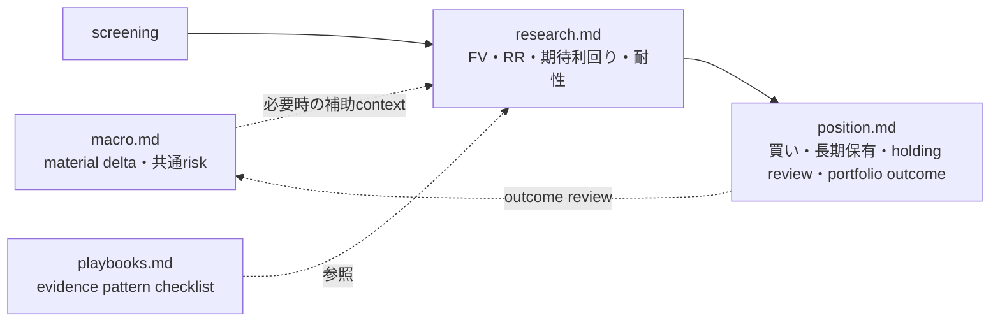

# Workflow — 単一ループの各工程

[`../doctrine.md`](../doctrine.md) §2 の単一ループを、1 工程 = 1 doc で辿る。各 doc は概念の説明・手順・最小限の例を持ち、成果物の機械契約は `records/_schemas/*.json` を正本にする。

| 工程 | doc | 役割 |
| --- | --- | --- |
| マクロ環境分析 | [`macro.md`](./macro.md) | 必要時にmaterial deltaと共通riskを短く記録し、個別調査の補助contextにする |
| 割安 screening | [`screening.md`](./screening.md) | 全上場銘柄から割安ゾーンを機械抽出し、candidatesのobserved / derived / estimateを出す |
| 個別銘柄リサーチ | [`research.md`](./research.md) | FV・RR・期待利回りを見積もり、塩漬け耐性を確認して採否と投入額を決める |
| 執行・保有 | [`position.md`](./position.md) | 注文・約定・長期保有・押し目買増し・holding review・portfolio outcome |
| Evidence pattern checklist | [`playbooks.md`](./playbooks.md) | `playbook_id` ごとの research 確認項目 |

上流の運用方針は [`../portfolio-management.md`](../portfolio-management.md)、triggerごとのe2e導線は [`../operations/decision-cycle.md`](../operations/decision-cycle.md)、構造は [`../architecture.md`](../architecture.md)、詳細な参照仕様は [`../reference/`](../reference/) を見る。
