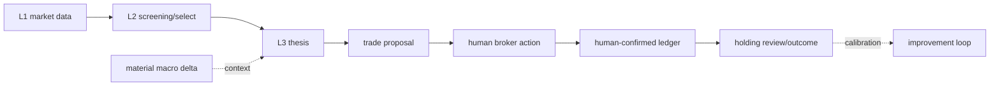

# Workflow

workflowは「工程内でどう変換するか」を持つ。triggerと工程横断の順序は[`operations/decision-cycle.md`](../operations/decision-cycle.md)、artifact・式・modelの意味は[`reference/`](../reference/)を正本とする。

| 工程 | input | output | doc |
| --- | --- | --- | --- |
| macro | indicator series、一次source、refresh trigger | material delta contextまたは変更なし | [`macro.md`](./macro.md) |
| screening | point-in-time market/financial data、rules | screening run、longlist、machine selection | [`screening.md`](./screening.md) |
| research | shortlist、一次IR、ledger annotation | thesis、independent review、defer/reject | [`research.md`](./research.md) |
| position | human result、thesis/review、ledger、market close | ledger draft、holding review、outcome | [`position.md`](./position.md) |
| playbook | candidate evidence pattern | research checklist | [`playbooks.md`](./playbooks.md) |

AIはL2 estimateをfactと呼ばず、L3へ採用する値だけsource lineage付きで固定する。
